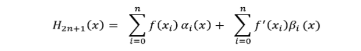
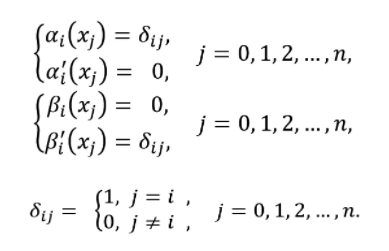
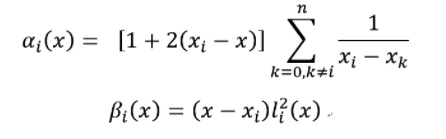

# Hermite


# Hermite插值法

## 公式




## 代码
```python
import matplotlib.pyplot as plt
import numpy as np
 
#计算基函数的导数值
def dl(i, xi):
    result = 0.0
    for j in range(0,len(xi)):
        if j!=i:
            result += 1/(xi[i]-xi[j])
    result *= 2
    return result
 
#计算基函数值
def l(i, xi, x):
    deno = 1.0
    nu = 1.0
 
    for j in range(0, len(xi)):
        if j!= i:
            deno *= (xi[i]-xi[j])
            nu *= (x-xi[j])
 
    return nu/deno
 
#Hermite插值函数
def get_Hermite(xi, yi, dyi):
    def he(x):
        result = 0.0
        for i in range(0, len(xi)):
            result += (yi[i]+(x-xi[i])*(dyi[i]-2*yi[i]*dl(i, xi))) * ((l(i,xi,x))**2)
        return result
    return he
 
import math
sr_x = [(i * math.pi) + (math.pi / 2) for i in range(-3, 3)]
sr_fx = [math.sin(i) for i in sr_x]
deriv = [0 for i in sr_x]                           # 导数都为 0
Hx = get_Hermite(sr_x, sr_fx, deriv)  # 获得插值函数
tmp_x = [i * 0.1 * math.pi for i in range(-20, 20)] # 测试用例
tmp_y = [Hx(i) for i in tmp_x]                      # 根据插值函数获得测试用例的纵坐标
 
#画图
plt.plot(sr_x, sr_fx, 'ro')
plt.plot(tmp_x, tmp_y, 'b-')
plt.title('Hermite Interpolation')
plt.show()

```


