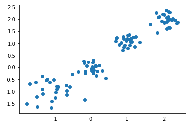
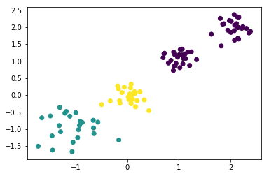
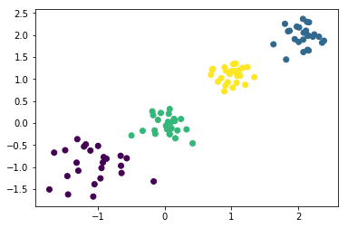
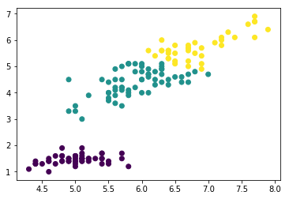
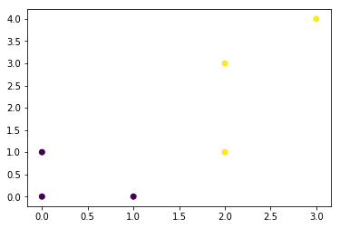

# kmeans


## 通过sklearn模块实现

```python
import numpy as np
import matplotlib.pyplot as plt
from sklearn import metrics
from sklearn.datasets import make_blobs
from sklearn.cluster import KMeans
from sklearn.datasets import load_iris
%matplotlib inline

X,y = make_blobs(n_samples=100,n_features=2,centers=[[-1,-1],[0,0],[1,1],[2,2]],cluster_std=[0.4,0.2,0.2,0.2])#使用make_blobs生成训练数据,生成100个样本,每个样本2个特征,共4个聚类,聚类中心分别为[-1,-1],[0,0],[1,1],[2,2],聚类方差分别为0.4,0.2,0.2,0.2
plt.scatter(X[:,0],X[:,1])#画出训练样本的散点图,散点图的横坐标为样本的第一维特征,纵坐标为样本的第二维特征
plt.show()
```





```python
kmeans = KMeans(n_clusters=3)#生成kmeans分类器,聚类数量为3,其余参数使用默认值。

y_pred = kmeans.fit_predict(X)#使用fit_predict方法计算聚类中心并且预测每个样本的聚类索引。

plt.scatter(X[:,0],X[:,1],c=y_pred)#画出训练样本的散点图,散点图的横坐标为样本的第一维特征,纵坐标为样本的第二维特征,将各聚类结果显示为不同的颜色
plt.show()
```





```python
kmeans = KMeans(n_clusters=4)#生成kmeans分类器,聚类数量为4,其余参数使用默认值。

y_pred = kmeans.fit_predict(X)#使用fit_predict方法计算聚类中心并且预测每个样本的聚类索引。

plt.scatter(X[:,0],X[:,1],c=y_pred)#画出训练样本的散点图,散点图的横坐标为样本的第一维特征,纵坐标为样本的第二维特征,将各聚类结果显示为不同的颜色
plt.show()
```





```python
iris = load_iris()     #导入iris数据集,iris数据集包含了150个样本,分别属于3类,每个样本包含4个特征
data_train=iris.data   #iris样本集的样本特征
label_train=iris.target #iris样本集的样本标签
```


```python
kmeans = KMeans(n_clusters=3)#生成kmeans分类器,聚类数量为3,其余参数使用默认值。
y_predict = kmeans.fit_predict(data_train)#使用fit_predict方法计算聚类中心并且预测每个样本的聚类索引。

plt.scatter(data_train[:,0],data_train[:,2],c=y_predict)#画出训练样本的散点图,散点图的横坐标为样本的第一维特征,纵坐标为样本的第三维特征,将各聚类结果显示为不同的颜色

plt.show()
```




## 手动实现


```python
import numpy as np
import matplotlib.pyplot as plt
```


```python
center = np.array([[0,0],[0,1]])
cls_num = 2
```


```python
X = np.array([[0,0],[0,1],[2,1],[2,3],[3,4],[1,0]])
max_iter = 10
cls = np.zeros(X.shape[0])
run = True
while run and max_iter > 0:
    for i,x in enumerate(X):
        tmp = np.argmin(np.sum(np.power(x - center,2),axis=1))
        cls[i] = tmp
    run = False
    # 重新计算聚类中心
    for i in range(cls_num):
        data = X[cls==i] # 取相同类别的样本
        new_center = np.mean(data,axis=0) # 对相同类别的x和y取平均值
        if np.sum(np.abs(center[i]-new_center),axis=0) > 1e-4:
            center[i] = new_center # 更新中心
            run = True
    max_iter -= 1
plt.scatter(X[:,0],X[:,1],c=cls)
plt.show()
```



## kernel kmeans
已知kmeans的核心公式为下：


这里可以看到,实际上就是计算每个样本点簇中心的距离,然后判断出到哪个簇中心距离最短,然后分给那个簇。然后下次迭代时,簇中心就按照新分配的点重新进行计算了,然后所有的点再同样计算样本点到簇中心的距离,重新分配到不同的簇中。所以这样不断迭代下去,就能够收敛了,得到最后的聚类效果。

核k-means,概括地来说,就是将数据点都投影到了一个高维的特征空间中（为啥要这么做呢,主要是突显出不同样本中的差异）,然后再在这个高维的特征空间中,进行传统的k-means聚类。主要的思想就是这么简单,比起传统普通的k-means就多了一个步核函数的操作。所以它的公式也与传统k-means很相近：


但实际中很难计算,因此需要改造,


改造成为


### 代码

```python
class KernelKmeans:

    def __init__(self, n_clusters, max_iter, kernel):

        self.n_clusters = n_clusters

        self.max_iter = max_iter

        self.kernel = kernel

  

    def fit(self, X):

        self.centroids = X[np.random.choice(X.shape[0], self.n_clusters, replace=False)]

        for i in range(self.max_iter):

            distances = np.array([self.kernel(X, centroid) for centroid in self.centroids])

            self.labels = np.argmin(distances, axis=0)

            self.centroids = np.array([X[self.labels == j].mean(axis=0) for j in range(self.n_clusters)], dtype=np.float32)

  

    def predict(self, X):

        distances = np.array([self.kernel(X, centroid) for centroid in self.centroids])

        return np.argmin(distances, axis=0)

  

def gaussian_kernel(X, y):

    return np.exp(-np.linalg.norm(X - y, axis=1)**2 / 2)
```


