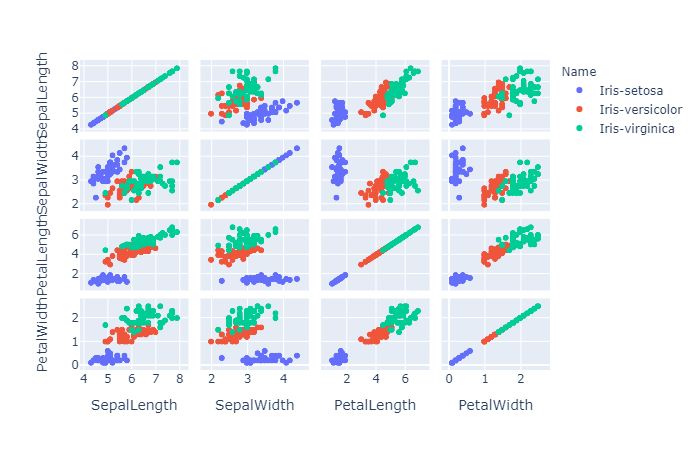

# plotly


# `plotly`学习：

```python
import plotly.graph_objects as go
```

是画图的主要库

## **选择类型**

```python
go.Scatter()
```

画点或者画线


在`Scatter()`中传入`mode='markers’`即可创建散点图


默认`mode='lines'`即直线图


也可以`mode='lines+markers'`设为折线图


> `go.Bar()`建立柱状图
>
> `go.Scatter()`建立散点或者折线图
>
> `go.Scatter3d()`建立3d散点图，可以传入mode参数同上

在创建这些图表的过程中，可以传入marker或line参数修改一些细节

散点图时传入`marker={'size':3,'color':'red'}`设置散点

size为点的尺寸，colorscale设置色级，showscale决定是否显示颜色范围。

在这里color也可以传入一系列数将不同数据的颜色分开，常用在classification问题中


折线图时，传入`line={"dash":"dot}#设置为虚线    `设置线

`ps:dash 为dot时为虚线，为dash时是由短线组成的虚线，为dashdot时为由点和短线组成的虚线`

有时候数据不是连续的，中间可能会断层，这时候需要指定`connectgaps`参数，为Ture时，将断点连起来

​	也可以传入name参数修改图例名称。

## **图表优化**

在创建完图表之后可以对其进行优化

`fig = go......`

```python3
fig.update_layout(
    title='title',#图表标题
    xaxis_title='xlable',#x轴名称
    yaxis_title='ylable',#y轴名称
    width=   ,#画布宽度
    height=   ,#画布高度
    template=  
    '''画布风格有以下几种选择：ggplot2，seaborn，simple_white，plotly，plotly_white，plotly_dark，presentation，xgridoff，ygridoff，gridon，none。默认是plotly'''
)
```


## **颜色分类**

`import plotly.express as px`


> `fig  = px.scatter(data,x=data[],y=data[],color='某一列')`
>
> `fig = px.scatter_3d(data,x=data[],y=data[],z=data[],color='某列')`

`fg.show()`

~~注意这个scatter的s是小写的，不要出错哦~~


**用这个可以显示渐变的颜色以更好的分类。**

## **直方图**

创立直方图

用

`go.Histogram(data[''],xbins={'size':10})#xibns修改组距 即每一个柱的宽度`


`fig = go.Figure(hist)`


`fig.update_layout(bargap=0.1)#修改至每一段图的间距，即修改每个柱间的距离`


## **多维图表**

多维的图表的话用`plotly.express`里的函数


`fg = px.scatter_matrix(data,dimensions=[''],color='某一列')`


其中第二个参数是传入的各列名字的列表

- 

> `plotly`画图的一般步骤
> 1.导入模块：
> `import plotly`
>
> `import plotly.graph_objects as go`
>
> `import pandas`
>
> 
>
> 2.用pandas读入csv文件
> `data = pandas.read_csv('')`
>
> 
>
> 3.选择建立的图标类型，是柱状图，还是散点图，还是折线图，还是3d图。
>
> 
>
> 
>
> 4.以折线图为例
> `scatter = go.Scatter(x='x轴数据',y=‘y轴数据’，name='图例名称')`
>
> `fg = go.Figure(scatter)`
>
> `fg.show()`
>
> `ps:若要建立多个图例的表，需要以下操作。`
> `scatter1=go.....`
>
> `scatter2=go.....`
>
> `........`
>
> `scattern=go.....`
>
> `fg = go.Figure((scatter1,scatter2......))`
>
> 
>
> 可以用循环写入
> 最后
>
> `fg.show()`
>
> 
>
> 5.注意的地方：
> 柱状图注意要显示每个柱子上面的数字的话要加上`text`参数，然后令`textposition`参数的值为`outside`


