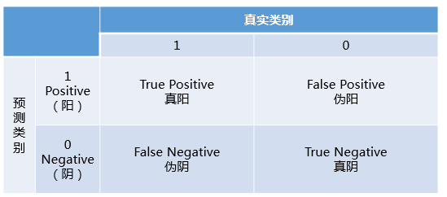
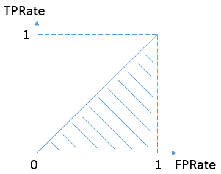
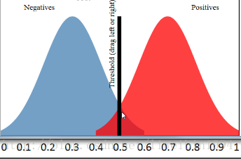

# ROC曲线

# ROC曲线
-----
了解什么是ROC曲线和AUC之前，要先了解什么是混淆矩阵。

混淆矩阵中有着Positive、Negative、True、False的概念，其意义如下：

- 称预测类别为1的为Positive（阳性），预测类别为0的为Negative（阴性）。
- 预测正确的为True（真），预测错误的为False（伪）。

因此有了True Postive Rate、False Postive Rate两个概念
-  $TPRate = \frac{TP}{TP+FN}$
-  $FPRate = \frac{FP}{FP+TN}$

- TPRate的意义是所有真实类别为1的样本中，预测类别为1的比例。
- FPRate的意义是所有真实类别为0的样本中，预测类别为1的比例。

按照定义，AUC即ROC曲线下的面积，而ROC曲线的横轴是FPRate，纵轴是TPRate，当二者相等时，即y=x，如下图: 

这样的分类器和瞎猜没啥区别，我们可以看成AUC的最小值为0.5。

而我们希望分类器达到的效果是：对于真实类别为1的样本，分类器预测为1的概率（即TPRate），要大于真实类别为0而预测类别为1的概率（即FPRate），即y＞x。这是理所当然的，分类器肯定要分对的嘛。

我们知道，在二分类（0，1）的模型中，一般我们最后的输出是一个概率值，表示结果是1的概率。那么我们最后怎么决定输入的x是属于0或1呢？我们需要一个 **阈值**，超过这个阈值则归类为1，低于这个阈值就归类为0。

所以，不同的阈值会导致分类的结果不同，也就是混淆矩阵不一样了，FPR和TPR也就不一样了。所以当阈值从0开始慢慢移动到1的过程，就会形成很多对(FPR, TPR)的值，将它们画在坐标系上，就是所谓的ROC曲线了。

看这张图：

当阈值选取为0.5时，阈值右边的视为 **预测为正例** ，阈值左边的视为 **预测为负例** 。由于准确度为$\frac{TP+TN}{all}$，因此可得此时的准确度为90%。
看这张图：

阈值设定为0.6，即右边视为 **预测为正例** ，红色的为实际为正例，蓝色的为实际为负例，因此很容易得到FP=0，因为阈值右边没有蓝色区域，可以这么理解。

当蓝色区域与红色区域基本重叠时，ROC曲线就和接近y=x这条线了。

**其实，AUC表示的是正例排在负例前面的概率**

我们知道阈值可以取不同，也就是说，分类的结果会受到阈值的影响。如果使用AUC的话，因为阈值变动考虑到了，所以评估的效果更好。

最后说说AUC的优势，AUC的计算方法同时考虑了分类器对于正例和负例的分类能力，在样本不平衡的情况下，依然能够对分类器作出合理的评价。

## AUC计算
