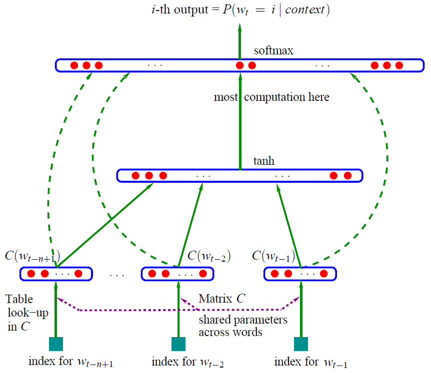
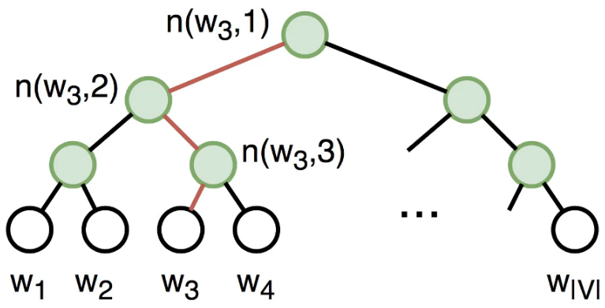

# Word Embedding


# 词嵌入

## 介绍

> **词嵌入**是[自然语言处理](https://baike.baidu.com/item/自然语言处理)（NLP）中[语言模型](https://baike.baidu.com/item/语言模型)与[表征学习](https://baike.baidu.com/item/表征学习)技术的统称。概念上而言，它是指把一个维数为所有词的数量的高维空间嵌入到一个维数低得多的连续[向量空间](https://baike.baidu.com/item/向量空间)中，每个单词或词组被映射为实数[域](https://baike.baidu.com/item/域)上的向量。
>
> 词嵌入的方法包括[人工神经网络](https://baike.baidu.com/item/人工神经网络)、对词语同现矩阵[降维](https://baike.baidu.com/item/降维)、[概率模型](https://baike.baidu.com/item/概率模型)以及单词所在上下文的显式表示等。
>
> 在底层输入中，使用词嵌入来表示词组的方法极大提升了NLP中[语法分析器](https://baike.baidu.com/item/语法分析器)和[文本情感分析](https://baike.baidu.com/item/文本情感分析)等的效果。

以上是百度百科中对词嵌入的定义。本文只介绍传统的词向量，也就是固定的词向量。deep contextualized词向量模型在本博客预训练模型内容里面。词嵌入也可以称为词表征(word representation)，可以粗略得把它分为三个阶段：

**一、特征工程阶段，以词袋模型为典型代表。**

**二、浅层表证阶段，以word2vec为典型代表。**

**三、深层表征阶段，以基于transformer的Bert为典型代表。**

本文介绍了一、二两部分内容

## 语言模型

一句话，语言模型是这样一个模型：**对于任意的词序列，它能够计算出这个序列是一句话的概率**。

具体的详见本博客有关语言模型的文章。

为什么要介绍语言模型，因为NLP的做预训练一般选择用语言模型任务来做的。

语言模型主要有： N-gram LM、FeedForward Neural Network LM、RNN LM和GPT系列

本文会涉及到Neural Network LM，其本质是一个语言模型，词向量只是其在训练过程中的一个副产物。

## 特征工程阶段(基于计数的方法)

### One-Hot

最简单的方法是将单词表示为 one-hot 向量：对于词汇表中的第 i 个单词，向量在第 i 个维度上具有 1，在其余维度上具有 0。在机器学习中，这是表示分类特征的最简单方法。

One-Hot的缺点很明显，它对自己代表的词一无所知，没有捕捉到词的意义。

### 词袋模型

即无视词语的顺序，只关心出现的次数，以下都属于词袋模型。在文本匹配领域也有类似的字面意义的匹配。本博客有相关内容。
### TFIDF

权重也可以作为词向量表示。也可以计算文本相似度等，本博客有相关内容。

### 共现矩阵
详见本博客共现矩阵
### PPMI
详见本博客互信息相关博文。

中文名字为正点互信息，公式如下

$$
PPMI(w, c) = max(0, PMI(w, c)) \\\\
PMI(w, c) = log\frac{P(w,c)}{P(w)P(c)} = log \frac{N(w,c)|(w,c)|}{N(w)N(c)}
$$

事实证明，word2vec被证明可以隐式逼近PMI矩阵的因式分解。

```text
『Neural Word Embedding as Implicit Matrix Factorization』这篇论文就详细讨论了这个问题。
```

### 主题模型

这个更是重量级，见本博客。

## 浅层表征阶段(基于推理的方法)

### NNLM

#### 介绍

先来张经典的图片



这就是大名鼎鼎的神经网络语言模型（其它的语言模型详见本博客语言模型部分）

学习任务是输入某个句中单词$W_t=i$前面句子的t-1个单词，要求网络正确预测单词$W_t=i$，即最大化：

$$
P(W_t=i | W_1, W_2, \dots W_{(t-1)}; \theta)
$$

前面任意单词 $W_i$用Onehot编码（比如：0001000）作为原始单词输入，之后乘以矩阵Q后获得向量 $C(W_i)$，每个单词的 $C(W_i)$ 拼接，上接隐层，然后接softmax去预测后面应该后续接哪个单词。

这个$C(W_i)$是什么？

这其实就是单词对应的Word Embedding值，那个矩阵Q包含V行，V代表词典大小，每一行内容代表对应单词的Word embedding值。只不过Q的内容也是网络参数，需要学习获得，训练刚开始用随机值初始化矩阵Q，当这个网络训练好之后，矩阵Q的内容被正确赋值，每一行代表一个单词对应的Word embedding值。

所以你看，通过这个网络学习语言模型任务，这个网络不仅自己能够根据上文预测后接单词是什么，同时获得一个副产品，就是那个矩阵Q，这就是单词的Word Embedding是被如何学会的。

#### 参数解释

- 训练样本(Context(w), w),w是语料C的每一个词，Context(w)为取其前n-1个词
- 投影层向量$X_w$: 将该训练样本(Context(w), w)的前n-1个词的词向量首尾拼接在一起，这里的词向量可以用独热编码表示。$X_w$的形状为 $(n-1)\times m$，这里的m为词汇表的所有词的个数。
- 隐藏层向量$Z_w$:

$$
Z_w = tanh(WX_w+p)
$$

- 输出层向量$y_w$: 维度为N=|D|,即词典D中词的个数。

$$
y_w = Uz_w + q
$$
在对$y_w$做softmax后，$y_w$的分量就表示当前词是w的概率

$$
p(w|Context(w)) = \frac{e^{y_w,iw}}{\sum_{i-1}^N e^{y^{w, i}} }
$$

#### 优点与缺点

NNLM相对于N-grams语言模型，有以下优点：

1. 词语与词语间的相似度可以通过词向量来体现
2. 基于词向量的模型自带『平滑化』功能，无需额外处理。

当然也有缺点，缺点就是计算量太大。

下面就重点介绍一下word2vec，相比于NNLM来说这是专门训练词向量的一种工具，而词向量对于NNLM来说只是一个副产物，其本质还是一个语言模型。

#### 代码

代码来自[https://github.com/graykode/nlp-tutorial](https://github.com/graykode/nlp-tutorial)

```python
import torch
import torch.nn as nn
import torch.optim as optim

def make_batch():
    input_batch = []
    target_batch = []

    for sen in sentences:
        word = sen.split() # space tokenizer
        input = [word_dict[n] for n in word[:-1]] # create (1~n-1) as input
        target = word_dict[word[-1]] # create (n) as target, We usually call this 'casual language model'

        input_batch.append(input)
        target_batch.append(target)

    return input_batch, target_batch

# Model
class NNLM(nn.Module):
    def __init__(self):
        super(NNLM, self).__init__()
        self.C = nn.Embedding(n_class, m)
        self.H = nn.Linear(n_step * m, n_hidden, bias=False)
        self.d = nn.Parameter(torch.ones(n_hidden))
        self.U = nn.Linear(n_hidden, n_class, bias=False)
        self.W = nn.Linear(n_step * m, n_class, bias=False)
        self.b = nn.Parameter(torch.ones(n_class))

    def forward(self, X):
        X = self.C(X) # X : [batch_size, n_step, m]
        X = X.view(-1, n_step * m) # [batch_size, n_step * m]
        tanh = torch.tanh(self.d + self.H(X)) # [batch_size, n_hidden]
        output = self.b + self.W(X) + self.U(tanh) # [batch_size, n_class]
        return output

if __name__ == '__main__':
    n_step = 2 # number of steps, n-1 in paper
    n_hidden = 2 # number of hidden size, h in paper
    m = 2 # embedding size, m in paper

    sentences = ["i like dog", "i love coffee", "i hate milk"]

    word_list = " ".join(sentences).split() # ['i', 'like', 'dog', 'dog', 'i', 'love', 'coffee', 'i', 'hate', 'milk']
    word_list = list(set(word_list)) # ['i', 'like', 'dog', 'love', 'coffee', 'hate', 'milk']
    word_dict = {w: i for i, w in enumerate(word_list)} # {'i':0, 'like':1, 'dog':2, 'love':3, 'coffee':4, 'hate':5, 'milk':6}
    number_dict = {i: w for i, w in enumerate(word_list)} # {0:'i', 1:'like', 2:'dog', 3:'love', 4:'coffee', 5:'hate', 6:'milk'}
    n_class = len(word_dict)  # number of Vocabulary, just like |V|, in this task n_class=7

    model = NNLM()

    criterion = nn.CrossEntropyLoss()
    optimizer = optim.Adam(model.parameters(), lr=0.001)

    input_batch, target_batch = make_batch()
    input_batch = torch.LongTensor(input_batch)
    target_batch = torch.LongTensor(target_batch)

    # Training
    for epoch in range(5000):
        optimizer.zero_grad()
        output = model(input_batch)

        # output : [batch_size, n_class], target_batch : [batch_size]
        loss = criterion(output, target_batch)
        if (epoch + 1) % 1000 == 0:
            print('Epoch:', '%04d' % (epoch + 1), 'cost =', '{:.6f}'.format(loss))

        loss.backward()
        optimizer.step()

    # Predict
    predict = model(input_batch).data.argmax(1, keepdim=True)

    # Test
    print([sen.split()[:2] for sen in sentences], '->', [number_dict[n.item()] for n in predict.squeeze()])

```

### word2vec

Word2Vec是从大量文本语料中以无监督的方式学习语义知识的一种模型，它被大量地用在自然语言处理（NLP）中。那么它是如何帮助我们做自然语言处理呢？Word2Vec其实就是通过学习文本来用词向量的方式表征词的语义信息，即通过一个嵌入空间使得语义上相似的单词在该空间内距离很近。Embedding其实就是一个映射，将单词从原先所属的空间映射到新的多维空间中，也就是把原先词所在空间嵌入到一个新的空间中去。

Word2Vec和NNLM不一样，NNLM的主要任务是要学习一个解决语言模型任务的网络结构，语言模型就是要看到上文预测下文，而word embedding只是无心插柳的一个副产品。但是Word2Vec目标不一样，它单纯就是要word embedding的，这是主产品，所以它完全可以随性地这么去训练网络。
(skip-gram与CBOW只是word2vec的变体。)

#### 训练思路

Word2Vec 是一个模型，其参数是词向量。这些参数针对某个目标进行迭代优化。目标迫使词向量“知道”一个词可能出现的上下文：训练向量以预测相应词的可能上下文。正如您从分布假设中所记得的那样，如果向量“知道”上下文，它们就“知道”单词的含义。

- 获取一个巨大的文本语料库；
- 使用滑动窗口浏览文本，一次移动一个单词。在每一步，都有一个中心词和上下文词（此窗口中的其他词）；
- 对于中心词，计算上下文词的概率；
- 调整向量以增加这些概率。

#### 推导

以Skip-grams模型为例，首先清楚几个概念，中心词、背景词（上下文词）、负采样词。中心词就是我们的输入，因为skip-grams相当于在一句话中扣去一个词，然后用这个词预测这句话的其余词。形式上给人的感觉就是一对多，这里的一句话其实不是一句话，是我们设定的窗口大小，比如一句话"I miss xwh very much"，
设置中心词为xwh，窗口大小为1，那么背景词就是"miss"和"very"。那么对于我们的模型来说，miss和very就是正例，就是我们的预测值(sigmoid后)的值接近于1的，而其余的词就是负例，就是使其值接近于0的。所以负采样就是从这些负例中随机抽取一些负例，不然每次都要计算单词表中所有单词的sigmoid值，这个计算量很大，而使用负采样就大大缩小了计算量。


##### 目标函数：负似然对数

对于每个位置$t=1,\dots, T$，在文本语料库中，Word2Vec在给定中心词的m大小窗口内预测上下文词$w_t$:

$$
Likelihood=L(\theta)=\prod_{t=1}^T\prod_{-m\leq j\leq m, j\neq0} P(w_{t+j} | w_t, \theta)
$$

目标函数$J(\theta)$为平均负对数似然

$$
Loss = J(\theta) = -\frac{1}{T}\sum_{t=1}^T\sum_{-m\leq j\leq m, j\neq0} logP(w_{t+j}|w_t, \theta)
$$

对于每个单词w我们都有两个向量：

- $v_w$当w是中心词
- $u_w$当w时背景词

训练完毕后，我们只使用$v_w$，即只使用从输入层到隐藏层的权重。

对于中心词w，上下文词c的概率为：

$$
P(c|w) = \frac{exp(u_c^Tv_w)}{\sum_{o\in V}exp(u_o^Tv_w)}
$$

这就是softmax函数。

##### 训练

$\theta^{new} = \theta^{old} - \alpha \nabla_\theta J(\theta)$

一次进行一次更新，每次更新都是针对一对中心词和其中一个背景词。损失函数：

$$
Loss = J(\theta) = -\frac{1}{T}logL(\theta)= -\frac{1}{T}\sum_{t=1}^T\sum_{-m\leq j\leq m, j\neq0} logP(w_{t+j}|w_t, \theta)\\\\=\frac{1}{T}\sum_{t=1}^T\sum_{-m\leq j\leq m, j\neq0}J_{t,j}(\theta).
$$

其中$J_{t,j}(\theta) = -logP(w_{t+j}|w_t, \theta)$

以"I miss xwh very much"这句话为例子，中心词为"xwh"，其中一个背景词为miss，则损失项为

$$
J_{t,j}(\theta) = -logP(miss|xwh) = -log\frac{exp(u_{miss}^Tv_{xwh})}{\sum_{o\in V}exp(u_o^Tv_{xwh})} = \\\\-u_{miss}^Tv_{xwh}+log\sum_{o\in V} exp(u_o^Tv_{xwh})
$$

这是中心词对应其中一个背景词的损失函数，如果要求总的损失，则将所有背景词的损失相加，然后将所有样本的损失求平均，就是上面的Loss。其实这就是交叉熵损失函数，是个多分类问题，预测的target相当于miss对应的数字，也就是序列值，具体的pytorch代码为

`loss = (-output_layer[:, Y] + torch.log(torch.sum(torch.exp(output_layer), dim=1))).mean()`

这里的output_layer就是神经网络的输出层，注意这里的都是对batch操作，这里求出的loss是这个batch上最终的loss，而不是一对中心词与背景词的loss。理解了这个简单的word2vec模型就算理解了。
下面求一下梯度：
注意这里的c为center word, o为上下文词
$$
\frac{\partial logP(w_o|w_c)}{\partial v_c} =
\frac{\partial}{\partial v_c}log\frac{exp(u_0^Tv_c)}{\sum_{i=1}^{|V|}exp(u_i^Tv_c)}\\\\=
\frac{\partial}{\partial v_c}log\, exp(u_o^Tv_c) - \frac{\partial}{\partial v_c}log\sum_{i=1}^{|V|}exp(u_i^Tv_c)
$$

左边的：

$$
\frac{\partial}{\partial v_c}log\, exp(u_o^Tv_c)=\frac{\partial}{\partial v_c}u_o^Tv_c=u_o
$$

第二部分推导

$$
\begin{aligned}
\frac{\partial}{\partial {v}\_{c}} \log \sum_{i=1}^{|V|} \exp \left({u}\_{i}^{T} {v}\_{c}\right) &=\frac{1}{\sum_{i=1}^{|V|} \exp \left({u}\_{i}^{T} {v}\_{c}\right)} \cdot \frac{\partial}{\partial {v}\_{c}} \sum_{x=1}^{|V|} \exp \left({u}\_{x}^{T} {v}\_{c}\right) \\\\
&=\frac{1}{A} \cdot \sum_{x=1}^{|V|} \frac{\partial}{\partial {v}\_{c}} \exp \left({u}\_{x}^{T} {v}\_{c}\right) \\\\
&=\frac{1}{A} \cdot \sum_{x=1}^{|V|} \exp \left({u}\_{x}^{T} {v}\_{c}\right) \frac{\partial}{\partial {v}\_{c}} {u}\_{x}^{T} {v}\_{c} \\\\
&=\frac{1}{\sum_{i=1}^{|V|} \exp \left({u}\_{i}^{T} {v}\_{c}\right)} \sum_{x=1}^{|V|} \exp \left({u}\_{x}^{T} {v}\_{c}\right) {u}\_{x} \\\\
&=\sum_{x=1}^{|V|} \frac{\exp \left({u}\_{x}^{T} {v}\_{c}\right)}{\sum_{i=1}^{|V|} \exp \left({u}\_{i}^{T} {v}\_{c}\right)} {u}\_{x} \\\\
&=\sum_{x=1}^{|V|} P\left(w_{x} \mid w_{c}\right) {u}\_{x}
\end{aligned}
$$

综上所述

$$
\frac{\partial \log P\left(w_{o} \mid w_{c}\right)}{\partial {v}\_{c}}={u}\_{o}-\sum_{j \in V} P\left(w_{j} \mid w_{c}\right) {u}\_{j}
$$

通过上面计算得到梯度后，我们可以使用随机梯度下降来不断迭代模型参数$v_c$。其它模型参数$u_o$的迭代方式同理可得。最终，对于词典中任一索引为i的词，我们均得到该词作为中心词和背景词的两组词向量$v_i$和$u_i$

#### 负采样

在上面的示例中，对于每对中心词及其上下文词，我们必须更新上下文词的所有向量。这是非常低效的：对于每一步，进行更新所需的时间与词汇量大小成正比。

但是为什么我们必须在每一步都考虑词汇表中的所有上下文向量呢？例如，假设在当前步骤中，我们考虑的不是所有单词的上下文向量，而是当前目标和几个随机选择的单词。


以跳字模型为例讨论负采样。词典 $V$ 的大小之所以会在目标函数中出现，是因为中心词 $w_{c}$ 生成背景词 $w_{o}$ 的概率 $P\left(w_{o} \mid w_{c}\right)$ 使用了 softmax，而 softmax 考虑到了背景词可能是词 典中任一词，并体现在了 softmax 的分母上
我们不妨换个角度，假设中心词 $w_{c}$ 生成背景词 $w_{o}$ 由以下两个互相独立的联合事件组成来近 似

1. 中心词 $w_{c}$ 和背景词 $w_{o}$ 同时出现在该训练数据窗口

2. 中心词 $w_{c}$ 和噪声词不同时出现在该训练数据窗口

- 中心词 $w_{c}$ 和第 1 个噪声词 $w_{1}$ 不同时出现在训练数据窗口（噪声词 $w_{1}$ 按噪声词 分布 $P(w)$ 随机生成)
- ....
- 中心词 $w_{c}$ 和第 $K$ 个噪声词 $w_{k}$ 不同时出现在训练数据窗口 (噪声词 $w_{K}$ 按噪声 词分布 $P(w)$ 随机生成)

我们可以使用 $\sigma(x)=\frac{1}{1+\exp (-x)}$ 函数来表达中心词 $w_{c}$ 和背景词 $w_{o}$ 同时出现在训练数据 窗口的概率:

$$
P\left(D=1 \mid w_{o}, w_{c}\right)=\sigma\left({u}\_{o}^{T}, {v}\_{c}\right)
$$

那么，中心词 $w_{c}$ 生成背景词 $w_{o}$ 的对数概率可以近似为

$$
\log P\left(w_{o} \mid w_{c}\right)=\log \left[P\left(D=1 \mid w_{o}, w_{c}\right) \prod_{k=1, w_{k} \sim P(w)}^{K} P\left(D=0 \mid w_{k}, w_{c}\right)\right]
$$

其中后面的表示中心词和噪声词不同时出现在训练数据窗口的概率。
假设噪声词 $w_{k}$ 在词典中的索引为 $i_{k}$ ，上式可改写为

$$
\log P\left(w_{o} \mid w_{c}\right)=\log \frac{1}{1+\exp \left(-{u}\_{o}^{T} {v}\_{c}\right)}+\sum_{k=1, w_{k} \sim P(w)}^{K} \log \left[1-\frac{1}{1+\exp \left(-{u}\_{i_{k}}^{T} {v}\_{c}\right)}\right]
$$

因此，有关中心词 $w_{c}$ 生成背景词 $w_{o}$ 的损失函数是($1-\sigma(x) = \sigma(-x)$):

$$
\begin{aligned}
-\log P\left(w_{o} \mid w_{c}\right)=-\log \frac{1}{1+\exp \left(-{u}\_{o}^{T} {v}\_{c}\right)}-\sum_{k=1, w_{k} \sim P(w)}^{K} \log \frac{1}{1+\exp \left({u}\_{i_{k}}^{T} {v}\_{c}\right)}  \\\\
= -\log \sigma(u_o^Tv_c) - \sum_{k=1, w_k\sim P(w)} ^ K \log\sigma (-u_{ik}^Tv_c) 
\end{aligned}
$$

#### 与PPMI的关系
在引入负采样方法后，也就是变成了Skip-Gram with Negative Sample，简称为SGNS。回顾一下他的目标函数：


对于word2vec来说，训练完成以后，每一个token都会有两个向量，一个是作为中心词的，一个是作为上下文词的。假设存在一个矩阵$W=V_{word}*V_{context}$。

word2vec也可以理解成是对矩阵W的矩阵分解。那么，问题就变成这个matrix W是什么？

论文`NIPS-2014-neural-word-embedding-as-implicit-matrix-factorization-Paper`中有将SGNS的目标函数，一步步的变换，变成下面的形式（具体见论文）


上面的公式，左边的部分就是PMI，PMI是dense matrix，对模型优化带来很多困难，所以一般会用sparse matrix PPMI（positive PMI）来替代它。


至此我们找到了矩阵M，即


PPMI是基于计数的方法表达词向量，而word2vec是基于推理的方法表达词向量。后面介绍的Glove将基于计数的方法和基于推理的方法结合了起来。
#### 层序softmax

层序softmax利用了二叉树，树的每个节点代表了词典V中的每个词。每个词$w_i$对应词向量$v_i$。



设 $L(w)$ 为从二叉树根节点到代表词 $w$ 的叶子节点的路径上的节点数，并设 $n(w, i)$ 为该路径上第 $i$ 个节点，该节点的向量为 ${u}\_{n(w, j)}$ 。以上图为例， $L\left(w_{3}\right)=4$ 。那么，跳字模型和连续词袋模型所需 要计算的任意词 $w_{i}$ 生成词 $w$ 的概率为:

$$
P\left(w \mid w_{i}\right)=\prod_{j=1}^{L(w)-1} \sigma\left(\left[n(w, j+1)=l e f t_{-} \operatorname{child}(n(w, j))\right] \cdot {u}\_{n(w, j)}^{T} {v}\_{i}\right)
$$

其中，如果 $x$ 为真， $[x]=1$ ；反之 $[x]=-1$
由于 $\sigma(x)+\sigma(-x)=1, w_{i}$ 生成词典中任何词的概率之和为 1 :

$$
\sum_{w=1}^{V} P\left(w \mid w_{i}\right)=1
$$

上面公式可能比较抽象，下面举个具体的例子，计算 $w_{i}$ 生成 $w_{3}$ 的概率，由于在二叉树中由根到 $w_{3}$ 的路径需要向左、向右、再向左地遍历，所以得到

$$
P\left(w_{3} \mid w_{i}\right)=\sigma\left({u}\_{n\left(w_{3}, 1\right)}^{T} {v}\_{i}\right) \cdot \sigma\left(-{u}\_{n\left(w_{3}, 2\right)}^{T} {v}\_{i}\right) \cdot \sigma\left({u}\_{n\left(w_{3}, 3\right)}^{T} {v}\_{i}\right)
$$

由此，我们就可以使用随机梯度下降在跳字模型和连续词袋模型中不断迭代计算词典中所有词向量 ${v}$

最后一个问题，层序 softmax 的二叉树是如何建立的?

**这里的二叉树 Huffman 树，权重是语料库中 word 出现的频率**

#### 标准设置

- 模型: 带负采样的Skip-Gram(SGNS)
- 负采样的数目: 较小的数据集,15-20;较大的数据集,2-5。
- 词嵌入维度: 经常用的为300
- 滑动窗口大小: 5-10

#### 代码

##### 简单

```python
import numpy as np
import torch
import torch.nn as nn
import torch.optim as optim
import matplotlib.pyplot as plt

def random_batch():
    random_inputs = []
    random_labels = []
    random_index = np.random.choice(range(len(skip_grams)), batch_size, replace=False)

    for i in random_index:
        random_inputs.append(np.eye(voc_size)[skip_grams[i][0]])  # target 相当于onehot编码
        random_labels.append(skip_grams[i][1])  # context word

    return random_inputs, random_labels

# Model
class Word2Vec(nn.Module):
    def __init__(self):
        super(Word2Vec, self).__init__()
        # W and WT is not Traspose relationship
        self.W = nn.Linear(voc_size, embedding_size, bias=False) # voc_size > embedding_size Weight
        self.WT = nn.Linear(embedding_size, voc_size, bias=False) # embedding_size > voc_size Weight

    def forward(self, X):
        # X : [batch_size, voc_size]
        hidden_layer = self.W(X) # hidden_layer : [batch_size, embedding_size]
        output_layer = self.WT(hidden_layer) # output_layer : [batch_size, voc_size]
        return output_layer

if __name__ == '__main__':
    batch_size = 2 # mini-batch size
    embedding_size = 2 # embedding size

    sentences = ["apple banana fruit", "banana orange fruit", "orange banana fruit",
                 "dog cat animal", "cat monkey animal", "monkey dog animal"]

    word_sequence = " ".join(sentences).split()
    word_list = " ".join(sentences).split()
    word_list = list(set(word_list))
    word_dict = {w: i for i, w in enumerate(word_list)}
    voc_size = len(word_list)

    # Make skip gram of one size window
    skip_grams = []
    for i in range(1, len(word_sequence) - 1):
        target = word_dict[word_sequence[i]]
        context = [word_dict[word_sequence[i - 1]], word_dict[word_sequence[i + 1]]]
        for w in context:
            skip_grams.append([target, w])
    model = Word2Vec()

    criterion = nn.CrossEntropyLoss()
    optimizer = optim.Adam(model.parameters(), lr=0.001)

    # Training
    for epoch in range(5000):
        input_batch, target_batch = random_batch()
        input_batch = torch.Tensor(input_batch)
        target_batch = torch.LongTensor(target_batch)

        optimizer.zero_grad()
        output = model(input_batch)

        # output : [batch_size, voc_size], target_batch : [batch_size] (LongTensor, not one-hot)
        loss = criterion(output, target_batch)
        if (epoch + 1) % 1000 == 0:
            print('Epoch:', '%04d' % (epoch + 1), 'cost =', '{:.6f}'.format(loss))

        loss.backward()
        optimizer.step()

    for i, label in enumerate(word_list):
        W, WT = model.parameters()
        x, y = W[0][i].item(), W[1][i].item()
        plt.scatter(x, y)
        plt.annotate(label, xy=(x, y), xytext=(5, 2), textcoords='offset points', ha='right', va='bottom')
    plt.show()

```

这是没有任何训练技巧的版本，使用Linear的话要注意输入是独热编码的形式，而且设置bias=False，因为需要的只是权重矩阵，不需要偏置。下面是引入了负采样的技巧的版本，直接使用了nn.Embedding。
##### 复杂

```python
import logging
import pickle
import torch.nn.functional as F
import numpy as np
import torch
import torch.nn as nn
import torch.utils.data as Data
from collections import Counter
import random

import copy

logging.basicConfig(level=logging.INFO, format='%(asctime)s - %(levelname)s - %(message)s')

device = torch.device('cuda' if torch.cuda.is_available() else 'cpu')

C = 3 # window size
K = 15  # Number of negitive samples
epochs = 1
MAX_VOCAB_SIZE = 10000 # 单词表的长度
EMBEDDING_SIZE = 100 # 词嵌入的维数
batch_size = 32 
lr = 1e-3

with open("./text8/text8.train.txt", "r") as f:
    text = f.read()
text = text.lower().split()

vocab_dict = dict(Counter(text).most_common(MAX_VOCAB_SIZE-1))
vocab_dict["<UNK>"] = len(text) - np.sum(list(vocab_dict.values()))

word2idx = {word: i for i, word in enumerate(vocab_dict.keys())}
idx2word = {i: word for i, word in enumerate(vocab_dict.keys())}

word_counts = np.array([count for count in vocab_dict.values()])
word_freqs = word_counts / np.sum(word_counts)
word_freqs = word_freqs ** (3/4)  # 经验


class WordEmbeddingDataset(Data.Dataset):
    def __init__(self, text, word2idx, word_freqs):
        super(WordEmbeddingDataset, self).__init__()
        self.text_encoded = torch.LongTensor(
            [word2idx.get(word, word2idx["<UNK>"]) for word in text])
        self.word2idx = word2idx
        self.word_freqs = torch.Tensor(word_freqs)

    def __getitem__(self, index):
        center_words = self.text_encoded[index]
        pos_indices = list(range(index-C, index)) + \
            list(range(index+1, index+C+1))
        pos_indices = [i % len(self.text_encoded) for i in pos_indices]
        pos_words = self.text_encoded[pos_indices]
        select_weights = copy.deepcopy(self.word_freqs)
        select_weights[center_words] = 0
        select_weights[pos_words] = 0
        neg_words = torch.multinomial(
            select_weights, K * pos_words.shape[0], True)
        return center_words, pos_words, neg_words

    def __len__(self):
        return len(self.text_encoded)

dataset = WordEmbeddingDataset(text, word2idx, word_freqs)
dataloader = Data.DataLoader(dataset, batch_size=batch_size, shuffle=True)

class Model(nn.Module):
    def __init__(self, vocab_size, embedding_size):
        super(Model, self).__init__()
        self.embedding = nn.Embedding(vocab_size, embedding_size)
        self.embedding2 = nn.Embedding(vocab_size, embedding_size)
    
    def forward(self, input_lables, pos_labels, neg_labels):
        input_embedding = self.embedding(input_lables) # [batch_size, embedding_size]
        pos_embedding = self.embedding2(pos_labels) # [batch_size, window * 2, embedding_size]
        neg_embedding = self.embedding2(neg_labels) # [batch_size, K * window * 2, embedding_size]
        
        input_embedding = input_embedding.unsqueeze(2) # [batch_size, embedding_size, 1]
        
        pos_dot = torch.bmm(pos_embedding, input_embedding).squeeze(2) # [batch_size, window * 2]
        ## bmm == batch matrix multiply
        neg_dot = torch.bmm(neg_embedding, input_embedding).squeeze(2) # [batch_size, K * window * 2]
        
        log_pos = F.logsigmoid(pos_dot).sum(dim=1) # [batch_size]
        log_neg = F.logsigmoid(-1 * neg_dot).sum(dim=1) # [batch_size]

        return -(log_pos + log_neg).mean() # 对应上文推导的公式
    
    def input_embedding(self):
        return self.embedding.weight.detach().cpu().numpy()

model = Model(MAX_VOCAB_SIZE, EMBEDDING_SIZE).to(device)
optimizer = torch.optim.Adam(model.parameters(), lr=lr)

for epoch in range(epochs):
    for i, (input_labels, pos_labels, neg_labels) in enumerate(dataloader):
        input_labels = input_labels.long().to(device)
        pos_labels = pos_labels.long().to(device)
        neg_labels = neg_labels.long().to(device)
        optimizer.zero_grad()
        loss = model(input_labels, pos_labels, neg_labels)
        loss.backward()
        optimizer.step()
        if (i+1) % 100 == 0:
            logging.info(f"epoch: {epoch}, batch: {i+1}, loss: {loss.item()}")

embedding_weights = model.input_embedding()
torch.save(model.state_dict(), f"embedding-{EMBEDDING_SIZE}.pth")
with open("word2idx.pkl", "wb") as f:
    pickle.dump(word2idx, f)

with open("idx2word.pkl", "wb") as f:
    pickle.dump(idx2word, f)

with open("embedding_weights.pkl", "wb") as f:
    pickle.dump(embedding_weights, f)
```

### GloVe

GloVe 模型是基于计数的方法和预测方法（例如 Word2Vec）的组合。模型名称 GloVe 代表“Global Vectors”，体现了它的思想：该方法利用 语料库中的全局信息来学习向量。

正如我们之前看到的，最简单的基于计数的方法使用共现计数来衡量单词 w 和上下文c之间的关联：$N(w,c)$。 GloVe 也使用这些计数来构建损失函数：


$$
J(\theta) = \sum_{w,c\in V}f(N(w,c)) \cdot(u_c^Tv_w+b_c+\bar{b_w}-logN(w,c)^2)
$$


其中：
$$
f(x) = \begin{cases}
        (\frac{x}{x_{max}})^{0.75}, \quad if \;x < x_{max} \\\\
        1, \quad if \; x\geq x_{max}
        \end{cases}
$$

具体的推导可以看这个博客：[https://www.cnblogs.com/Lee-yl/p/11172255.html](https://www.cnblogs.com/Lee-yl/p/11172255.html)

可以看到GloVe并没有使用神经网络的方法。

与 Word2Vec 类似，我们也有不同的 中心词和上下文词向量——这些是我们的参数。此外，该方法对每个词向量都有一个标量偏置项。

特别有趣的是 GloVe 控制稀有词和频繁词影响的方式：每对 ( w , c ) 的损失以如下方式加权

- 罕见事件受到惩罚，
- 非常频繁的事件不会被过度加权。

## 关于word embedding

1. word embedding只能通过语言模型的训练获取吗？

不是的；事实上任何NLP任务都可以在训练过程中获取word embedding，甚至特定任务下的word embedding在特定任务中的使用效果还会更好（如基于fasttext的文本分类任务）。之所以我们平时提及的word embedding均是在语言模型任务中产生，私以为主要有这么几个原因：a).语言模型是无监督任务，存在海量训练语料，无需标注成本；b).语言模型任务本身要求较高，训练过程中可以学习大量的语义知识，进而生成高质的word representation。

2. 如何评估word embedding好坏？

有两种方式：第一种，把word embedding融入现有系统中，看其对系统性能的提升；第二，从语言学的角度对word embedding进行分析，如相似度、语义偏移等。更细节的可以参考[这里](https://www.zhihu.com/question/37489735)。
## 参考

参考：

>[https://blog.csdn.net/malefactor/article/details/83961886](https://blog.csdn.net/malefactor/article/details/83961886)
>[https://www.zybuluo.com/Dounm/note/591752](https://www.zybuluo.com/Dounm/note/591752)
>[https://lena-voita.github.io/nlp_course/word_embeddings.html](https://lena-voita.github.io/nlp_course/word_embeddings.html)
>[https://wmathor.com/index.php/archives/1430/](https://wmathor.com/index.php/archives/1430/)
>[https://zhuanlan.zhihu.com/p/27234078](https://zhuanlan.zhihu.com/p/27234078)\
>Rong X . word2vec Parameter Learning Explained[J]. Computer Science, 2014.


