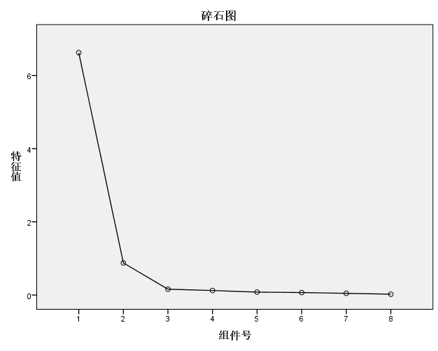

# 因子分析

# 因子分析
可以看成主成分分析（PCA）的发展和拓展

**如果数据之间有较强的相关性，我们就可以把它们打包到一起作为一个值。这就是所谓的[数据降维](https://www.zhihu.com/search?q=数据降维&search_source=Entity&hybrid_search_source=Entity&hybrid_search_extra={"sourceType"%3A"answer"%2C"sourceId"%3A724506022})。**

有较强的相关性，是我们可以做因子分析的前提条件。

> 林登(Linden)根据他收集的来自139名运动员的比赛数据，对第二次世界大战以来奥林匹克十项全能比赛的得分作了因子分析研究。这十个全能项目为：100米跑(x1)，跳远(x2)，铅球(x3)，跳高(x4)，400米跑(x5)，11米跨栏(x6)，铁饼(x7)，撑杆跳高(x8)，标枪(x9)，1500米跑(x10)。经标准化后所作的因子分析表明，十项得分基本上可归结于他们的 **短跑速度** 、 **爆发性臂力** 、 **爆发性腿力** 和 **耐力** 这四个方面，每一方面都称为一个因子。

因子分析的一般模型为：

$$
\begin{cases}
x_1 = u_1 + a_{11}f_1 + a_{12}f_2 + \dots + a_{1m}f_m + \epsilon_1 \\\\ 
x_2 = u_2 + a_{21}f_1 + a_{22}f_2 + \dots + a_{2m}f_m + \epsilon_2 \\\\
\vdots \\\\
x_p = u_p + a_{p1}f_1 + a_{p2}f_2 + \dots + a_{pm}f_m + \epsilon_p
\end{cases}
$$
其中f被称为公共因子，$\epsilon$被称为特殊因子，他们都是无法观测的随机变量。

可以用矩阵的形式记为$x=u+Af+\epsilon$

其中$f=(f_1,f_2,\dots,f_m)^T$被称为公因子向量，$\epsilon = (\epsilon_1,\epsilon_2,\dots,\epsilon_m)^T$被称为特殊因子向量，$A_{p*m}=(a_{ij})$

成为因子载荷矩阵。

主要说一下应用，原理不再赘述。

## 参数估计
为了建立因子模型，我们需要估计出因子载荷矩阵$A_{p*m}=(a_{ij})$，以及个性方差矩阵$D = diag(\sigma_1^2,\sigma_2^2,\dots,\sigma_p^2)$

SPSS中提供的方法有主成分法、未加权的最小平方法、综合最小平方法、最
大似然法、主轴因子法、Alpha因式分解法和映像因子法。

常用为主成分法。这一步可以得出来原始的因子载荷矩阵

## 因子旋转

得到因子模型后，其中的公共因子不一定能反映问题的实质特征，为了能更好地解释每一个公共因子的实际意义，且减少解释的主观性，可以通过因子旋转达到目的。因子旋转分为正交旋转与斜交旋转，经过正交旋转而得到的新的公共因子仍然保持彼此独立的性质，而斜交旋转得到的公共因子是相关的(违背了最初的假定，因此可以看作传统因子分析的拓展)，其实际意义更容易解释。但不论是正交旋转还是斜交旋转，都应当使新公共因子的载荷系数的绝对值尽可能接近0或1（这里默认了我们从相关系数矩阵进行计算）。

SPSS中也有一些因子旋转的方法，比如最大方差法，直接Oblimin，最大四次方值，最大平衡值或最优斜交。

常用的是最大方差法。

## 因子得分

因子分析是将变量表示为公共因子和特殊因子的线性组合；此外，我们可以反过来将公共因子表示为原变量的线性组合，即可得到因子得分。

$$
\begin{cases}
f_1 = b_{11}x_1 + b_{12}x_2 + \dots + b_{1p}x_p \\\\
f_2 = b_{21}x_1 + b_{22}x_2 + \dots + b_{2p}x_p \\\\
\vdots
f_m = b_{m1}x_1 + b_{m2}x_2 + \dots + b_{mp}x_p
\end{cases}
$$

计算因子得分有三种方法，分别为回归、Bartlett、和Anderson-Rubin，常用的为第三种方法。

## KMO检验与巴特利特球形检验

> KMO检验是Kaiser, Meyer和Olkin提出的，该检验是对原始变量之间的简单相关系数和偏相关系数的相对大小进行检验，主要应用于多元统计的因子分析。
> KMO统计量是取值在0和1之间，当所有变量间的简单相关系数平方和远远大于偏相关系数平方和
> 时，KMO值越接近于1，意味着变量间的相关性越强，原有变量越适合作因子分析；当所有变量
> 间的简单相关系数平方和接近0时，KMO值越接近于0,意味着变量间的相关性越弱，原有变量越
> 不适合作因子分析。
> 其中，Kaiser给出一个KMO检验标准：KMO>0.9,非常适合；0.8<KMO<0.9,适合；
> 0.7<KMO<0.8, 一般；0.6<KMO<0.7,不太适合；KMO<0.5,不适合。

> 巴特利特球形检验是一种检验各个变量之间相关性程度的检验方法。一般在做因子分析之前都要进行巴特利特球形检验，用于判断变量是否适合用于做因子分析。巴特利特球形检验是以变量的相关系数矩阵为出发点的。它的原假设是相关系数矩阵是一个单位阵（不适合做因子分析，指标之间的相关性太差，不适合降维），即相关系数矩阵对角线上的所有元素都是1，所有非对角线上的元素都为0。巴特利特球形检验的统计量是根据相关系数矩阵的行列式得到的。如果该值较大，且其对应的p值小于用户心中的显著性水平（一般为0.05），那么应该拒绝原假设，认为相关系数不可能是单位阵，即原始变量之间存在相关性，适合于作因子分析。相反不适合作因子分析。 

## 实际操作

在实际操作中，最少要对数据进行两次分析。

第一次的因子分析用于参考，来确定公共因子的数量。通过碎石检验来确定。

> 碎石检验（scree test）是根据碎石图来决定因素数的方法。Kaiser提出，可通过直接观察特征值的变化来决定因素数。当某个特征值较前一特征值的值出现较大的下降，而这个特征值较小，其后面的特征值变化不大，说明添加相应于该特征值的因素只能增加很少的信息，所以前几个特征值就是应抽取的公共因子数。

得到公共因子数目后再对数据进行重新分析。

然后根据旋转后的因子模型进行解释，可以理解为给因子起名。

下面是一些实际操作spss生成的表格与图片

| **KMO**  **和巴特利特检验** |          |         |
| --- | -- | - |
| KMO 取样适切性量数。        | .909     |         |
| 巴特利特球形度检验          | 近似卡方 | 719.113 |
| 自由度                      | 28       |         |
| 显著性                      | .000     |         |

可以看出可以进行因子分析。

| **公因子方差** |       |      |
| -- | --- |
|                | 初始  | 提取 |
| 100米(s)       | 1.000 | .950 |
| 200米(s)       | 1.000 | .939 |
| 400米(s)       | 1.000 | .892 |
| 800米(min)     | 1.000 | .900 |
| 1500米(min)    | 1.000 | .938 |
| 5000米(min)    | 1.000 | .965 |
| 10000米(min)   | 1.000 | .973 |
| 马拉松(min)    | 1.000 | .943 |

 

  提取方法：主成分分析法。  

可以看到提取后的方差很接近初始的公因子方差，则说明我们选择的2个因子是最主要的因子。

通过碎石图可以看出来前两个因子是最主要的，这里的组件就是因子，翻译的问题。

| 100米(s)     | .817 | .531  |
|  | --- |
| 200米(s)     | .867 | .432  |
| 400米(s)     | .915 | .233  |
| 800米(min)   | .949 | .012  |
| 1500米(min)  | .959 | -.131 |
| 5000米(min)  | .938 | -.292 |
| 10000米(min) | .944 | -.287 |
| 马拉松(min)  | .880 | -.411 |

这是原始的成分矩阵，可见两个因子对不同变量的可解释性比较差。

| 100米(s)     | .274 | .935 |
|  | -- |
| 200米(s)     | .376 | .893 |
| 400米(s)     | .543 | .773 |
| 800米(min)   | .712 | .627 |
| 1500米(min)  | .813 | .525 |
| 5000米(min)  | .902 | .389 |
| 10000米(min) | .903 | .397 |
| 马拉松(min)  | .936 | .261 |

这是旋转后的成分矩阵，这样就可以很好的解释我们的变量。

本例中的第1个公共因子更能代表后面五个变量，我们可以称为长跑因子（或耐力因子）；
第2个公共因子更能代表前三个变量，我们可称为短跑因子（爆发力因子）。

最后因子得分

| 100米(s)     | -.300 | .540  |
|  | ---- |
| 200米(s)     | -.222 | .459  |
| 400米(s)     | -.068 | .291  |
| 800米(min)   | .100  | .103  |
| 1500米(min)  | .207  | -.019 |
| 5000米(min)  | .324  | -.161 |
| 10000米(min) | .321  | -.156 |
| 马拉松(min)  | .406  | -.269 |

这是成分得分系数矩阵。通过代入可以得到f1和f2

和主成分分析一样，我们可以用因子得分f1和f2作为两个新的变量，来进行后续的建模（例如聚类、回归等）
**注意：因子分析模型不能用于综合评价，尽管有很多论文是这样写的，但这是
存在很大的问题的。例如变量的类型、选择因子的方法、旋转对最终的影响都
是很难说清的。**
