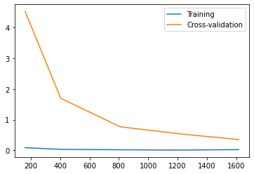

# 学习曲线


**学习曲线能判定偏差和方差问题**

```python
from sklearn.model_selection import train_test_split,learning_curve
import numpy as np
from sklearn.svm import SVC
from sklearn.datasets import load_digits
import matplotlib.pyplot as plt
```


```python
digits = load_digits()
X = digits.data
Y = digits.target
```


```python
train_sizes,train_loss,test_loss = learning_curve(SVC(gamma=0.001),X,Y,cv=10,
                                                 scoring='neg_mean_squared_error',
                                                train_sizes=[0.1,0.25,0.5,0.75,1])
```


```python
train_sizes
```


    array([ 161,  404,  808, 1212, 1617])


```python
train_loss
```


    array([[-0.        , -0.09937888, -0.09937888, -0.09937888, -0.09937888,
            -0.09937888, -0.09937888, -0.09937888, -0.09937888, -0.09937888],
           [-0.        , -0.03960396, -0.03960396, -0.03960396, -0.03960396,
            -0.03960396, -0.03960396, -0.03960396, -0.03960396, -0.03960396],
           [-0.        , -0.01980198, -0.01980198, -0.06435644, -0.01980198,
            -0.01980198, -0.01980198, -0.01980198, -0.01980198, -0.01980198],
           [-0.        , -0.01650165, -0.01320132, -0.01320132, -0.01320132,
            -0.01320132, -0.01320132, -0.01320132, -0.01320132, -0.01320132],
           [-0.02226345, -0.03215832, -0.00989487, -0.03215832, -0.03215832,
            -0.03215832, -0.03215832, -0.03215832, -0.03215832, -0.00989487]])


```python
test_loss
```


    array([[-1.26666667e+00, -1.43333333e+00, -3.96666667e+00,
            -9.73888889e+00, -6.95000000e+00, -5.24444444e+00,
            -3.02777778e+00, -5.25139665e+00, -3.48044693e+00,
            -4.85474860e+00],
           [-1.81111111e+00, -1.13333333e+00, -1.35555556e+00,
            -3.06666667e+00, -2.08333333e+00, -2.85000000e+00,
            -8.38888889e-01, -1.94413408e+00, -5.41899441e-01,
            -1.35195531e+00],
           [-1.71111111e+00, -3.61111111e-01, -5.11111111e-01,
            -9.61111111e-01, -6.16666667e-01, -5.88888889e-01,
            -1.22222222e-01, -9.16201117e-01, -7.76536313e-01,
            -1.14525140e+00],
           [-1.22222222e+00, -3.61111111e-01, -4.44444444e-01,
            -7.00000000e-01, -5.55555556e-01, -2.66666667e-01,
            -8.88888889e-02, -1.11731844e-02, -9.21787709e-01,
            -8.43575419e-01],
           [-9.33333333e-01, -0.00000000e+00, -2.66666667e-01,
            -2.83333333e-01, -2.77777778e-01, -3.61111111e-01,
            -8.88888889e-02, -5.58659218e-03, -9.21787709e-01,
            -4.18994413e-01]])


```python
train_mean = -np.mean(train_loss,axis=1)
test_mean = -np.mean(test_loss,axis=1)
```


```python
train_mean
```


    array([0.08944099, 0.03564356, 0.02227723, 0.01221122, 0.02671614])


```python
plt.plot(train_sizes,train_mean,label="Training")
plt.plot(train_sizes,test_mean,label="Cross-validation")
plt.legend()
plt.show()
```


​    

​    


```python

```


