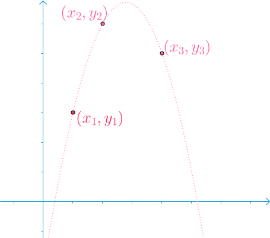

# 拉格朗日插值

# 插值算法

## 拉格朗日插值法

对于这几个点，想找到一根穿过他们的曲线。
我们可以合理地假设，这根曲线是一个二次多项式

$$
y = a_0 + a_1x + a_2x^2
$$

可以通过下面的方程组来解这个二次多项式：

$$
\begin{cases}
y_1 = a_0+a_1x_1+a_2x_1^2 \\\\
y_2 = a_0+a_1x_2+a_2x_2^2 \\\\
y_3 = a_0+a_1x_3+a_2x_3^2
\end{cases}
$$

下面开始阐述拉格朗日的思考
第一根曲线 $f_1(x)$ ，在$x_1$ 点处，取值为1，其余两点取值为0
第二根曲线 $f_2(x)$ ，在 $x_2$ 点处，取值为1，其余两点取值为0
第三根曲线 $f_3(x)$ ，在 $x_3$ 点处，取值为1，其余两点取值为0
那么

$$
f(x) = y_1f_1(x)+y_2f_2(x)+y_3f_3(x)
$$

可以一一穿过这三个点
### 推导
用符号表示$f_i(x_j), i=1,2,3,j=1,2,3$
需要满足的条件为

$$
f_i(x_j) = 
\begin{cases}
1  & i=j \\\\
0  & i\neq j 
\end{cases}
$$

则有

$$
f_i(x) = \prod_{j\neq i}^{1\leq j\leq 3}\frac{x-x_j}{x_i-x_j}
$$

最终得到

$$
f(x) = \sum_{i=1}{3}y_if_i(x)
$$

这就是拉格朗日插值法，推广到更多点的插值也很容易

