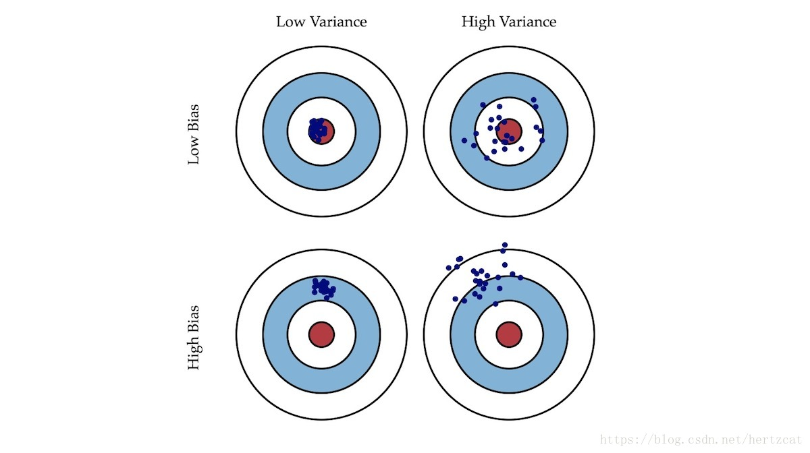
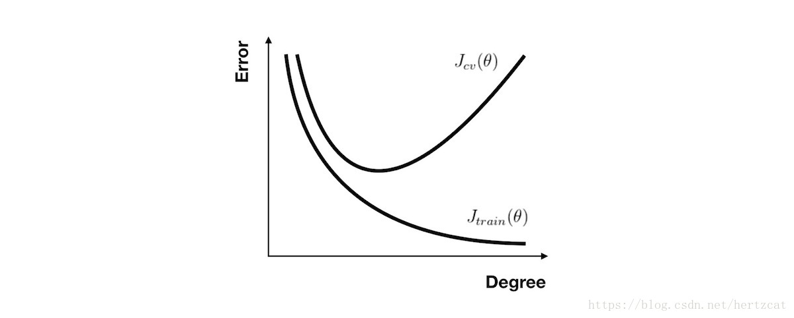

# 机器学习的一些概念

## 范数的定义

$$
{\lVert x \rVert}_p := \left(\sum_{i=1}^n{\lvert x_i\rvert}^p\right)^{\frac{1}{p}}
$$

## 标准化与归一化
### 定义
归一化和标准化都是对数据做变换的方式，将原始的一列数据转换到某个范围，或者某种形态。
>归一化：将一列数据变化到某个固定区间(范围)中，通常，这个区间是[0, 1]，广义的讲，可以是各种区间，比如映射到[0，1]一样可以继续映射到其他范围，图像中可能会映射到[0,255]，其他情况可能映射到[-1,1]；

>标准化：将数据变换为均值为0，标准差为1的分布。切记，并非一定是正态的；

>中心化：还有一种处理叫做中心化，也叫零均值处理，就是将每个原始数据减去这些数据的均值。

### 差异
1. 归一化会严格限定变换后的数据的范围，标准化没有严格的区间，变换后的数据没有范围，只是其均值为0，标注差为1.
2. 归一化对数据的缩放比例只与极值有关，而标准化缩放比例与所有的数据都有关。

### 标准化、归一化的好处
1. 统计建模中，如回归模型，自变量$X$的量纲不一致导致了回归系数无法直接解读或者错误解读；需要将$X$都处理到统一量纲下，这样才可比；
2. 机器学习任务和统计学任务中有很多地方要用到“距离”的计算，比如PCA，比如KNN，比如kmeans等等，假使算欧式距离，不同维度量纲不同可能会导致距离的计算依赖于量纲较大的那些特征而得到不合理的结果；
3. 参数估计时使用梯度下降，在使用梯度下降的方法求解最优化问题时， 归一化/标准化后可以加快梯度下降的求解速度，即提升模型的收敛速度。

## 决策边界

**所谓决策边界就是能够把样本正确分类的一条边界，主要有线性决策边界(linear decision boundaries)和非线性决策边界(non-linear decision boundaries)。**注意：决策边界是假设函数的属性，由参数决定，而不是由数据集的特征决定。下面主要举一些例子，形象化的来说明线性决策边界和非线性决策边界。

## 方差与偏差

当我们的模型表现不佳时，通常是出现两种问题，一种是 高偏差 问题，另一种是 高方差 问题。识别它们有助于选择正确的优化方式，所以我们先来看下 **偏差** 与 **方差** 的意义。

- **偏差**: 描述模型输出结果的期望与样本真实结果的差距。
- **方差**: 描述模型对于给定值的输出稳定性。

就像打靶一样，偏差描述了我们的射击总体是否偏离了我们的目标，而方差描述了射击准不准。接下来让我们通过各种情况下 **训练集** 和 **交叉验证集** 的 **误差** 曲线来直观地理解 高偏差 与 高方差 的意义。

对于 **多项式回归**，当次数选取较低时，我们的 训练集误差 和 交叉验证集误差 都会很大；当次数选择刚好时，训练集误差 和 交叉验证集误差 都很小；当次数过大时会产生过拟合，虽然 训练集误差 很小，但 交叉验证集误差 会很大（ 关系图如下 ）

对于 **正则化** 参数，使用同样的分析方法，当参数比较小时容易产生过拟合现象，也就是高方差问题。而参数比较大时容易产生欠拟合现象，也就是高偏差问题。

偏差和方差与数据噪声之和就是模型的泛化能力

模型的期望预测（这里x指所有的样本，期望预测为该模型的所有预测结果的期望。也可以表示有多个模型同时对x一个样本进行预测，期望预测为所有模型预测的期望）：

**样本数相同的不同训练集产生的方差（可以理解为测试集预测结果与训练集输出期望之间的方差，也可以直接理解为一个模型中所有的预测与预测期望之间的平方差）**：

**噪声（这里的噪声为人工标注的错误。）**：

期望输出与真实标记的差别称为偏差(也有两种理解，一种是多模型的预测期望与真实值之间的偏差，还有一种就直接是单模型的预测输出（因为单模型的预测期望就是它的输出了）与真实值之间的平方差就可以记为偏差的平方，其实这里应理解为多模型的情况

泛化误差也就是期望风险。

### 参考

>[参考1](https://zhuanlan.zhihu.com/p/38853908#:~:text=%E5%AF%B9%E5%AD%A6%E4%B9%A0%E7%AE%97%E6%B3%95%E9%99%A4%E4%BA%86%E9%80%9A%E8%BF%87%E5%AE%9E%E9%AA%8C%E4%BC%B0%E8%AE%A1%E5%85%B6%E6%B3%9B%E5%8C%96%E6%80%A7%E8%83%BD%E4%B9%8B%E5%A4%96%EF%BC%8C%E4%BA%BA%E4%BB%AC%E5%BE%80%E5%BE%80%E8%BF%98%E5%B8%8C%E6%9C%9B%E4%BA%86%E8%A7%A3%E5%AE%83%E4%B8%BA%E4%BB%80%E4%B9%88%E5%85%B7%E6%9C%89%E8%BF%99%E6%A0%B7%E7%9A%84%E6%80%A7%E8%83%BD%E3%80%82.%20%22%E5%81%8F%E5%B7%AE-%E6%96%B9%E5%B7%AE%E5%88%86%E8%A7%A3%22%EF%BC%88bias-variance%20decomposition%EF%BC%89%20%E5%B0%B1%E6%98%AF%E4%BB%8E%E5%81%8F%E5%B7%AE%E5%92%8C%E6%96%B9%E5%B7%AE%E7%9A%84%E8%A7%92%E5%BA%A6%E6%9D%A5%E8%A7%A3%E9%87%8A%E5%AD%A6%E4%B9%A0%E7%AE%97%E6%B3%95%E6%B3%9B%E5%8C%96%E6%80%A7%E8%83%BD%E7%9A%84%E4%B8%80%E7%A7%8D%E9%87%8D%E8%A6%81%E5%B7%A5%E5%85%B7%E3%80%82.%20%E5%9C%A8%E6%9C%BA%E5%99%A8%E5%AD%A6%E4%B9%A0%E4%B8%AD%EF%BC%8C%E6%88%91%E4%BB%AC%E7%94%A8%E8%AE%AD%E7%BB%83%E6%95%B0%E6%8D%AE%E9%9B%86%E5%8E%BB%E8%AE%AD%E7%BB%83%E4%B8%80%E4%B8%AA%E6%A8%A1%E5%9E%8B%EF%BC%8C%E9%80%9A%E5%B8%B8%E7%9A%84%E5%81%9A%E6%B3%95%E6%98%AF%E5%AE%9A%E4%B9%89%E4%B8%80%E4%B8%AA%E8%AF%AF%E5%B7%AE%E5%87%BD%E6%95%B0%EF%BC%8C%E9%80%9A%E8%BF%87%E5%B0%86%E8%BF%99%E4%B8%AA%E8%AF%AF%E5%B7%AE%E7%9A%84%E6%9C%80%E5%B0%8F%E5%8C%96%E8%BF%87%E7%A8%8B%EF%BC%8C%E6%9D%A5%E6%8F%90%E9%AB%98%E6%A8%A1%E5%9E%8B%E7%9A%84%E6%80%A7%E8%83%BD%E3%80%82.,%E7%84%B6%E8%80%8C%E6%88%91%E4%BB%AC%E5%AD%A6%E4%B9%A0%E4%B8%80%E4%B8%AA%E6%A8%A1%E5%9E%8B%E7%9A%84%E7%9B%AE%E7%9A%84%E6%98%AF%E4%B8%BA%E4%BA%86%E8%A7%A3%E5%86%B3%E8%AE%AD%E7%BB%83%E6%95%B0%E6%8D%AE%E9%9B%86%E8%BF%99%E4%B8%AA%E9%A2%86%E5%9F%9F%E4%B8%AD%E7%9A%84%E4%B8%80%E8%88%AC%E5%8C%96%E9%97%AE%E9%A2%98%EF%BC%8C%E5%8D%95%E7%BA%AF%E5%9C%B0%E5%B0%86%E8%AE%AD%E7%BB%83%E6%95%B0%E6%8D%AE%E9%9B%86%E7%9A%84%E6%8D%9F%E5%A4%B1%E6%9C%80%E5%B0%8F%E5%8C%96%EF%BC%8C%E5%B9%B6%E4%B8%8D%E8%83%BD%E4%BF%9D%E8%AF%81%E5%9C%A8%E8%A7%A3%E5%86%B3%E6%9B%B4%E4%B8%80%E8%88%AC%E7%9A%84%E9%97%AE%E9%A2%98%E6%97%B6%E6%A8%A1%E5%9E%8B%E4%BB%8D%E7%84%B6%E6%98%AF%E6%9C%80%E4%BC%98%EF%BC%8C%E7%94%9A%E8%87%B3%E4%B8%8D%E8%83%BD%E4%BF%9D%E8%AF%81%E6%A8%A1%E5%9E%8B%E6%98%AF%E5%8F%AF%E7%94%A8%E7%9A%84%E3%80%82.%20%E8%BF%99%E4%B8%AA%E8%AE%AD%E7%BB%83%E6%95%B0%E6%8D%AE%E9%9B%86%E7%9A%84%E6%8D%9F%E5%A4%B1%E4%B8%8E%E4%B8%80%E8%88%AC%E5%8C%96%E7%9A%84%E6%95%B0%E6%8D%AE%E9%9B%86%E7%9A%84%E6%8D%9F%E5%A4%B1%E4%B9%8B%E9%97%B4%E7%9A%84%E5%B7%AE%E5%BC%82%E5%B0%B1%E5%8F%AB%E5%81%9A%20%E6%B3%9B%E5%8C%96%E8%AF%AF%E5%B7%AE%EF%BC%88generalization%20error%EF%BC%89%20%E3%80%82.)
>[参考2](https://blog.csdn.net/qq_32742009/article/details/82142119)

### 改进策略

1. [高方差] 采集更多的样本数据，(参考正规方程)
2. [高方差] 减少特征数量，去除非主要的特征
3. [高偏差] 引入更多的相关特征
4. [高偏差] 采用多项式特征
5. [高偏差] 减小正则化参数 λ
6. [高方差] 增加正则化参数 λ 

## 学习曲线

无论你是要检查你的学习算法是否正常工作或是要改进算法的表现，**学习曲线** 都是一个十分直观有效的工具。**学习曲线** 的横轴是样本数，纵轴为 **训练集** 和 **交叉验证集** 的 **误差**
