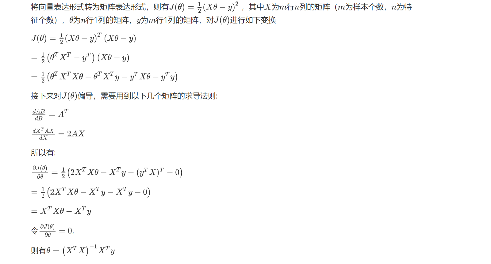

# 灰色预测模型


# 灰色预测模型

## 介绍
灰色预测模型（Gray Forecast Model）是通过少量的、不完全的信息，建立数学模型并做出预测的一种预测方法。是处理小样本（4个就可以）预测问题的有效工具，而对于小样本预测问题回归和神经网络的效果都不太理想。

灰色系统理论认为，尽管客观表象复杂，但总是有整体功能的，因此必然蕴含某种内在规律。关键在于如何选择适当的方式去挖掘和利用它。灰色系统时通过对原始数据的整理来寻求其变化规律的，这是一种就数据寻求数据的现实规律的途径，也就是灰色序列的生产。一切灰色序列都能通过某种生成弱化其随机性，显现其规律性。数据生成的常用方式有累加生成、累减生成和加权累加生成。常用的是累加生成。

## 建模
原始数据为$x^0 = (x^0(1),x^0(2),\dots \dots,x^0(n))$
### 累加生成

$$
x^1(n) = x^0(1) + x^0(2) + \dots \dots + x^0(n)
$$

### 加权临值生成

$$
z^1(n) = \alpha x^1(n) + (1-\alpha)x^1(n-1)
$$

由此得到的数列称为邻值生成数，权$\alpha$也称为生成系数。 特别地，当生成系数$\alpha=0.5$时，则称该数列为均值生成数，也称为等权邻值生成数。

### 灰色模型GM(1,1)
GM代表grey model（灰色模型），GM(1,1)是一阶微分方程模型。

### 1.数据检验
数据要先进行准指数规律检验，看看能不能进行灰色预测建模，检验不通过的数据无法进行建模。
首先计算级比

$$
\lambda(k) = \frac{x^0(k-1)}{x^0(k)}, k = 2,3,\dots,n
$$

如果所有的级比都落在可容覆盖区间 $X=(e^{\frac{-2}{n+1}}, e^{\frac{2}{n+1}})$内，则数列$x^{(0)}$可以建立GM(1,1)模型进行灰色预测。否则就需要对数据做适当的变换处理，如平移等。

### 2.构建灰色模型
定义灰微分方程：

$$
x^0(k) = -az^1(k) + b
$$

其中-a为发展系数，b为灰作用度。
可以近似的看成线性回归方程$y = kx+b$，从而求出a和b
先矩阵化。

$$
u = (a,b)^T , Y = 
\begin{bmatrix}
x^0(2)\\\\
x^0(3)\\\\
\vdots \\\\
x^0(n)
\end{bmatrix},
B = \begin{bmatrix}
-z^1(2) & 1 \\\\
-z^1(3) & 1 \\\\ 
\vdots & \vdots \\\\
-z^1(n) & 1
\end{bmatrix}
$$

用最小二乘法的到u的估计值即a,b的估计值

$$
\hat{u} = (B^TB)^{-1}B^TY
$$

即正规方程。具体的推导看下图


### 3.预测
相应的白化模型为

$$
\frac{dx^1(t)}{dt} = -\hat{a}x^1(t) + \hat{b}
$$

通过高数中学的微分方程的求解可以得到

$$
\hat{x}^1(t) = \left(x^0(1) - \frac{\hat{b}}{\hat{a}} \right)e^{-\hat{a}(t-1)} + \frac{\hat{b}}{\hat{a}}
$$

由$x^0$与$x^1$的关系可以得到

$$
\hat{x}^0(m+1) = (1-e^{\hat{a}})\left(x^0(1)-\frac{\hat{b}}{\hat{a}}  \right)e^{-\hat{a}m},其中m=1,2,\dots,n-1
$$

这样就可以进行预测。

### 4.检验
(1)残差检验
相对残差：$\epsilon_r(k)=\frac{\mid x^0(k) - \hat{x}^0(k) \mid}{x^0(k)}$
平均相对残差：$\bar{\epsilon_r} = \frac{1}{n-1}\sum_{k=2}^n \mid \epsilon_r(k) \mid$
$\bar{\epsilon_r}$越小，说明拟合效果越好。

(2)后验差检验法
计算残差$e(k) = x^0(k) - \hat{x}^0(k)$
计算原始序列$x^0$的方差和残差e的方差

$$
S_1 = \frac{1}{n} \sum_{k=1}^n(x^0(k) - \bar{x})^2 \\\\
S_2 = \frac{1}{n} \sum_{k=1}^n(e(k)-\bar{e})^2
$$

观察后验差比
$C = \frac{S_2}{S_1}$
然后通过查表观察效果。


## 代码

```python
import numpy as np
import pandas as pd
import matplotlib.pyplot as plt
from itertools import accumulate

data = np.array([71.1, 72.4, 72.4, 72.1, 71.4, 72, 71.6])
lens = len(data)

# 数据检验
## 计算级比
lambds = []
for i in range(1, lens):
    lambds.append(data[i-1]/data[i])
## 计算区间
X_min = np.e**(-2/(lens+1))
X_max = np.e**(2/(lens+1))
## 检验
is_ok = True
for lambd in lambds:
    if (lambd < X_min or lambd > X_max):
        is_ok = False
if (is_ok == False):
    print('该数据未通过检验')
else:
    print('该数据通过检验')

# 构建灰色模型GM(1,1)
## 累加数列
data_1 = list(accumulate(data))
## 灰导数及临值生成数列
ds = []
zs = []
for i in range(1, lens):
    ds.append(data[i])
    zs.append(-1/2*(data_1[i-1]+data_1[i]))
## 求a、b
B = np.array(zs).reshape(lens-1,1)
one = np.ones(lens-1)
B = np.c_[B, one]  # 加上一列1
Y = np.array(ds).reshape(lens-1,1)
a, b = np.dot(np.dot(np.linalg.inv(np.dot(B.T, B)), B.T), Y) # 正规方程
print('a='+str(a))
print('b='+str(b))

# 预测
def func(k):
    c = b/a
    return (data[0]-c)*(np.e**(-a*k))+c
data_1_hat = []  # 累加预测值
data_0_hat = []  # 原始预测值
data_1_hat.append(func(0))
data_0_hat.append(data_1_hat[0])
for i in range(1, lens+5):  # 多预测5次
    data_1_hat.append(func(i))
    data_0_hat.append(data_1_hat[i]-data_1_hat[i-1])
print('预测值为：')
for i in data_0_hat:
    print(i)

# 模型检验
## 预测结果方差
data_h = np.array(data_0_hat[0:7]).T
sum_h = data_h.sum()
mean_h = sum_h/lens
S1 = np.sum((data_h-mean_h)**2)/lens
## 残差方差
e = data - data_h
sum_e = e.sum()
mean_e = sum_e/lens
S2 = np.sum((e-mean_e)**2)/lens
## 后验差比
C = S2/S1
## 结果
if (C <= 0.35):
    print('1级，效果好')
elif (C <= 0.5 and C >= 0.35):
    print('2级，效果合格')
elif (C <= 0.65 and C >= 0.5):
    print('3级，效果勉强')
else:
    print('4级，效果不合格')

# 画图
plt.figure(figsize=(9, 4), dpi=100)
x1 = np.linspace(1, 7, 7)
x2 = np.linspace(1, 12, 12)
plt.subplot(121)
plt.title('x^0')
plt.plot(x2, data_0_hat, 'r--', marker='*')
plt.scatter(x1, data, marker='^')
plt.subplot(122)
plt.title('x^1')
plt.plot(x2, data_1_hat, 'r--', marker='*')
plt.scatter(x1, data_1, marker='^')
plt.show()

```


