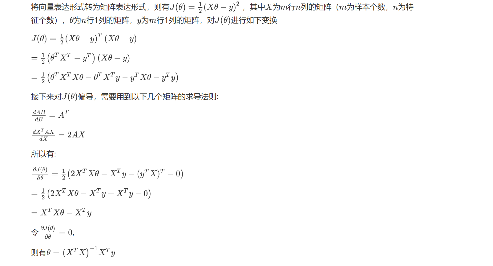
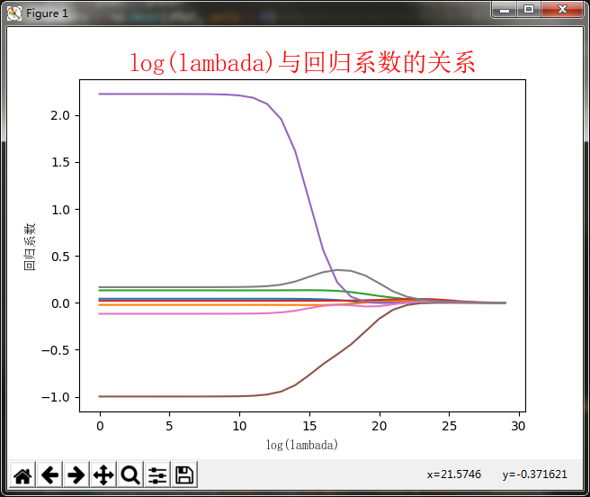

# 线性回归


参考：[https://cuijiahua.com/blog/2017/11/ml_11_regression_1.html](https://cuijiahua.com/blog/2017/11/ml_11_regression_1.html)

## 什么是回归？

回归的目的是预测数值型的目标值。最直接的办法是依据输入写出一个目标值的计算公式。

HorsePower = 0.0015 * annualSalary - 0.99 * hoursListeningToPublicRadio

这就是所谓的回归方程（regression equation），其中的0.0015和-0.99称为回归系数（regression weights），求这些回归系数的过程就是回归。一旦有了这些回归系数，再给定输入，做预测就非常容易了。具体的做法是用回归系数乘以输入值，再将结果全部加在一起，就得到了预测值。

说到回归，一般都是指线性回归（linear regression），所以本文里的回归和线性回归代表同一个意思。线性回归意味着可以将输入项分别乘以一些常量，再将结果加起来得到输出。

这里的线性可以是对变量的线性，也可以是对参数的线性。比如$y=x^2$可以认为是一个线性函数。

## 正规方程推导

将向量表达形式转为矩阵表达形式，则有 $J(\theta)=\frac{1}{2}(X \theta-y)^{2}$ ，其中 $X$ 为 $m$ 行 $n$ 列的矩阵（ $m$ 为样本个数， $n$ 为特 征个数)， $\theta$ 为 $n$ 行1列的矩阵， $y$ 为 $m$ 行1列的矩阵，对 $J(\theta)$ 进行如下变换
$$
\begin{aligned}
&J(\theta)=\frac{1}{2}(X \theta-y)^{T}(X \theta-y) \\\\
&=\frac{1}{2}\left(\theta^{T} X^{T}-y^{T}\right)(X \theta-y) \\\\
&=\frac{1}{2}\left(\theta^{T} X^{T} X \theta-\theta^{T} X^{T} y-y^{T} X \theta-y^{T} y\right)
\end{aligned}
$$
接下来对 $J(\theta)$ 偏导，需要用到以下几个矩阵的求导法则:
$$
\begin{aligned}
&\frac{d A B}{d B}=A^{T} \\\\
&\frac{d X^{T} A X}{d X}=2 A X
\end{aligned}
$$
所以有:
$$
\begin{aligned}
&\frac{\partial J(\theta)}{\partial \theta}=\frac{1}{2}\left(2 X^{T} X \theta-X^{T} y-\left(y^{T} X\right)^{T}-0\right) \\\\
&=\frac{1}{2}\left(2 X^{T} X \theta-X^{T} y-X^{T} y-0\right) \\\\
&=X^{T} X \theta-X^{T} y \\\\
&\text { 令 } \frac{\partial J(\theta)}{\partial \theta}=0 ｝ \\\\
{\text { 则有 } \theta=\left(X^{T} X\right)^{-1} X^{T} y}
\end{aligned}
$$


值得注意的是，上述公式中包含逆矩阵，也就是说，这个方程只在逆矩阵存在的时候使用，也即是这个矩阵是一个方阵，并且其行列式不为0。

除了这种方法，也可以使用最小二乘法来解决。

## 局部加权线性回归

线性回归的一个问题是有可能出现欠拟合现象，因为它求的是具有小均方误差的无偏估 计。显而易见，如果模型欠拟合将不能取得好的预测效果。所以有些方法允许在估计中引入一 些偏差，从而降低预测的均方误差。

其中的一个方法是局部加权线性回归（Locally Weighted Linear [Regression](https://cuijiahua.com/blog/tag/regression/)，LWLR）。
普通线性回归:
$$
\min J_R=\sum_{i=1}^m\left(g\left(x_i\right)-y_i\right)^2
$$
局部加权线性回归:
$$
\min J_{L R}=\sum_{i=1}^m \theta_i\left(g\left(x_i\right)-y_i\right)^2
$$
这里唯一的区别是加入了权重 $\theta$, 采用之前的最小二乘法求解权数 $\mathbf{w}$ :
$$
\hat{\mathbf{w}}^*=\arg \min _{\hat{\mathbf{w}}} \theta(\mathbf{y}-\mathbf{X} \hat{\mathbf{w}})^T(\mathbf{y}-\mathbf{X} \hat{\mathbf{w}})
$$
在该方法中，我们给待预测点附近的每个点赋予一定的权重。与kNN一样，这种算法每次预测均需要事先选取出对应的数据子集。该算法解除回归系数W的形式如下：


$$
\hat{w} = (X^T\theta X)^{-1}X^T\theta y
$$
其中W是一个矩阵，这个公式跟我们上面推导的公式的区别就在于W，它用来给每个店赋予权重。

LWLR使用"核"（与支持向量机中的核类似）来对附近的点赋予更高的权重。核的类型可以自由选择，最常用的核就是高斯核，高斯核对应的权重如下：


$$
\theta(i,i) = exp\left ( \frac{ (x^{(i)}-x)^2}{-2k^2}\right)
$$


这样就构造了一个只含对角元素的权重矩阵 $w$ ，并且点xi与 $x$ 越接近， $\theta(i, i)$ 的值越大，当 $x i$ 与 $x$ 非常接近时， $\theta(i, i)$ 的值趋于 1 ，我们再回头看之前的优化式:
$$
\min J_{L R}=\sum_{i=1}^m \theta_i\left(g\left(x_i\right)-y_i\right)^2
$$
对于一个数据点，与其靠近的点，权重大，与其相距较远的点，权重小，从而优化问题会有所偏倚，靠近的点对该数据点的回归拟合起较大作用，而相距较远的 点由于权数很小，造成的影响基本可以忽略不计，这样就等同于每个点的回归都是基于与其相距较近的点为基础，而忽略了较远的点，这也就是同部加权线性回归局部的由来，因为它着重考虑目标点同部的数据点为回归基础.

可以看到，加权函数只有一个系数，那就是分母上的 $k$ ，当K取很小时， exp得到的很多值均趋于 0 ，此时只有很少一部分样本用于训练，而当k取很大时， exp的值 不会很快趋于 0 ，从而会有一大部分点用于训练，我们可以通过调整k的值，决定这个‘局部'的大小究竟是多大

如果数据的特征比样本点还多应该怎么办？如果矩阵有多重共线性怎么办？很显然，此时我们不能再使用上文的方法进行计算了，因为矩阵X不是满秩矩阵，非满秩矩阵在求逆时会出现问题。

解决的方法就是正则化。在线性回归中，正则化主要有L1正则化与L2正则化，L1正则化对应LASSO回归，L2正则化对应岭回归。

```python
#!/usr/bin/env python
#-*- coding:utf-8 -*-
from numpy import *
import matplotlib.pyplot as plt
"""
打开一个用tab键分隔的文本文件
parameters:
    fileName -文件名
return:
    dataMat -数据矩阵
    labelMat -目标值向量
"""
def loadDataSet(fileName):      
    numFeat = len(open(fileName).readline().split('\t')) - 1 #得到列数，不包括最后一列，默认最后一列值为目标值
    dataMat = []; labelMat = []
    fr = open(fileName)
    for line in fr.readlines():
        lineArr =[]
        curLine = line.strip().split('\t')
        for i in range(numFeat):
            lineArr.append(float(curLine[i]))
        dataMat.append(lineArr)
        labelMat.append(float(curLine[-1]))
    return dataMat,labelMat
"""
计算最佳拟合直线
parameters:
    xArr -给定的输入值
    yArr -给定的输出值
return:
    ws -回归系数
"""
def standRegres(xArr,yArr):
    xMat = mat(xArr); yMat = mat(yArr).T    #将数据保存到矩阵中
    #计算x.T *x
    xTx = xMat.T @ xMat
    #使用linalg.det()方法来判断它的行列式是否为零，即是否可逆
    if linalg.det(xTx) == 0.0:
        return
       
    #使用最小二乘法计算w值
    ws = linalg.inv(xTx) @ xMat.T @ yMat
    return ws
"""
计算局部加权线性回归系数
parameters:
    testPoint -待预测数据
    xArr -给定输入值
    yArr -给定输出值
    k -高斯核的k值，决定对附近的点赋予多大的权重
return:
    testPoint * ws -回归预测的估计值
"""
def lwlr(testPoint, xArr, yArr, k=1.0):
    xMat = mat(xArr); yMat = mat(yArr).T #读入数据到矩阵
    m = shape(xMat)[0]
    #创建对角权重矩阵，该矩阵为方阵，矩阵维数为样本点个数
    theta = eye(m, m)
    #遍历整个数据集
    for i, x in enumerate(xMat):
    #计算待预测数据与每个样本点的差值
        x_i = (testPoint - x) @ (testPoint - x).T
    #计算每个样本点对应的权重值，随着样本点与待预测点距离的递增，权重将以指数级衰减
        theta[i][i] = exp(x_i / (-2 * k ** 2))
    #计算x.T θ x
    xT_theta_x = xMat.T @ theta @ xMat
    #判断矩阵是否可逆
    if linalg.det(xT_theta_x) == 0:
        return
    
    #使用最小二乘法计算w值
    ws = linalg.inv(xT_theta_x) @ (xMat.T @ (theta @ yMat))
    
    return testPoint*ws
"""
测试函数
parameters:
    testArr -测试数据集
    xArr -给定输入值
    yArr -给定输出值
    k -高斯核的k值
return:
    yHat -预测值
"""
def lwlrTest(testArr, xArr, yArr,k=1.0):
    m = shape(xArr)[0]
    yHat = zeros(m)
    for i in range(m):
        yHat[i] = lwlr(testArr[i],xArr,yArr,k)
    return yHat
"""
计算预测误差的平方和
parameters:
    yArr -给定y值
    yHatArr -预测y值
return:
    ((yArr-yHatArr)**2).sum() -误差矩阵
"""
def rssError(yArr,yHatArr):
    return ((yArr-yHatArr)**2).sum()
if __name__=='__main__':
    abX,abY = loadDataSet('linear_regression_abalone/abalone.txt')
    yHat01 = lwlrTest(abX[0:99],abX[0:99],abY[0:99],0.1)
    yHat1 = lwlrTest(abX[0:99],abX[0:99],abY[0:99],1)
    yHat10 = lwlrTest(abX[0:99],abX[0:99],abY[0:99],10)
    print("使用局部加权线性回归预测误差：")
    print("核为0.1时：",rssError(abY[0:99],yHat01.T))
    print("核为1时：",rssError(abY[0:99],yHat1.T))
    print("核为10时：",rssError(abY[0:99],yHat10.T))
    yHat01 = lwlrTest(abX[100:199],abX[0:99],abY[0:99],0.1)
    yHat1 = lwlrTest(abX[100:199],abX[0:99],abY[0:99],1)
    yHat10 = lwlrTest(abX[100:199],abX[0:99],abY[0:99],10)
    print("使用局部加权线性回归预测误差在新数据上的表现：")
    print("核为0.1时：",rssError(abY[100:199],yHat01.T))
    print("核为1时：",rssError(abY[100:199],yHat1.T))
    print("核为10时：",rssError(abY[100:199],yHat10.T))
    ws = standRegres(abX[0:99],abY[0:99])
    yHat = mat(abX[100:199])*ws
    print("使用标准线性回归预测误差为：",rssError(abY[100:199],yHat.T.A))
```
## 岭回归

岭回归即我们所说的L2正则线性回归，在一般的线性回归最小化均方误差的基础上增加了一个参数w的L2范数的罚项，从而最小化罚项残差平方和：


$$
min\mid \mid Xw-y \mid\mid_2^2 + \lambda \mid\mid w\mid\mid_2^2
$$
简单说来，岭回归就是在普通线性回归的基础上引入单位矩阵。回归系数的计算公式变形如下：


$$
\hat{w} = (X^TX+\lambda I)^{-1}X^Ty
$$
式中，矩阵I是一个mxm的单位矩阵，加上一个λI从而使得矩阵非奇异，进而能对矩阵求逆。

当$\lambda$过小，则相当于原来的正规方程，会造成过拟合，而$\lambda$过大时，模型的方差会更小，但偏差会变大，所以岭回归的关键是找到一个合理的$\lambda$值来平衡模型的方差和偏差。

岭回归最先用来处理特征数多于样本数的情况，现在也用于在估计中加入偏差，从而得到更好的估计。这里通过引入λ来限制了所有w之和，通过引入该惩罚项，能够减少不重要的参数，这个技术在统计学中也可以叫做缩减（shrinkage）。

缩减方法可以去掉不重要的参数，因此能更好地裂解数据。此外，与简单的线性回归相比，缩减法能够取得更好的预测效果。



图绘制了回归系数与log(λ)的关系。在最左边，即λ最小时，可以得到所有系数的原始值（与线性回归一致）；而在右边，系数全部缩减成0；在中间部分的某个位置，将会得到最好的预测结果。想要得到最佳的λ参数，可以使用交叉验证的方式获得，文章的后面会继续讲解。

## Lasso

Lasso对回归系数做了限定，对应的约束条件如下：


$$
\sum_{k=1}^n|w_k| \leq \lambda
$$

而岭回归的约束条件如下：


$$
\sum_{k=1}^nw_k^2 \leq \lambda
$$

唯一不同点在于，Lasso的约束条件用绝对值取代了平方和，虽然约束形式稍作变化，但结果大相径庭，细微的变化极大地增加了计算复杂度。所以用更简单的前向逐步回归来取代。

## 前向逐步回归

前向逐步线性回归算法属于一种贪心算法，即每一步都尽可能减少误差。我们计算回归系数，不再是通过公式计算，而是通过每次微调各个回归系数，然后计算预测误差。那个使误差最小的一组回归系数，就是我们需要的最佳回归系数。

该算法的伪代码如下：

数据标准化，使其满足0均值和单位方差。

- 在每轮迭代中：
    - 设置当前最小误差lowestError为正无穷
    - 对每个特征
        - 增大或缩小
            - 改变一个系数得到新的W
            - 计算新W下的误差
            - 如果误差Error小于当前最小误差lowestError：设置Wbest等于当前的W
        - 将W设置为新的Wbest

## 代码
使用的优化算法是梯度下降法，还有一个随机梯度下降
```python
import numpy as np

import matplotlib.pyplot as plt

  

np.random.seed(42)

w = np.array([2, 1, 4, 5, 3])

d = len(w)

X = []

Y = []

for _ in range(1000000):

    x = np.random.randn(d)

    y = w.dot(x) + np.random.randn()

    X.append(x)

    Y.append(y)

X = np.array(X)

Y = np.array(Y)

  

def mse(y_true, y_test):

    return ((y_true - y_test) ** 2) / len(y_true)

  

def gradient(y_true, y_test):

    return 2 * (y_test - y_true) / len(y_true)

  

def batch_gradient_descent(w, alpha, x, y):

    y_pred = x.dot(w)

    error = mse(y, y_pred).mean()

    grad = np.dot(x.T, gradient(y, y_pred))

    w = w - alpha * grad

  

    return w, error

  

def stochastic_gradient_descent(w, alpha, x, y, epoch):

    alpha_update = alpha

    for i in range(len(x)):

        y_pred = x[i].dot(w)

        grad = np.dot(x[i].T, (y_pred - y[i])) * 2 / len(x)

        w = w- alpha_update * grad

        alpha_update = alpha_update / (epoch+1)

    error = mse(y, x.dot(w)).mean()

  

    return w, error

  
  

X_test = []

Y_test = []

for _ in range(10000):

    x = np.random.randn(d)

    y = w.dot(x) + np.random.randn()

    X_test.append(x)

    Y_test.append(y)

  

X_test = np.array(X_test)

Y_test = np.array(Y_test)

  
  
  

def l2_mse(y_true, y_test, l, w):

    return ((y_true - y_test) ** 2) / len(y_true) + l * np.sum(w ** 2)

  

def l2_gradient(y_true, y_test):

    return 2 * (y_test - y_true) / len(y_true)

  

def batch_gradient_descent_with_l2(w, alpha, x, y, l):

    y_pred = x.dot(w)

    error = l2_mse(y, y_pred, l, w).mean()

    grad = np.dot(x.T, l2_gradient(y, y_pred))

    w = w - alpha * grad - alpha * l * w *2

  

    return w, error

  
  
  

if __name__ == "__main__":

    train_loss = []

    test_loss = []

    print("Batch Gradient Descent")

    for epoch in range(1000):

        w, error = batch_gradient_descent(w, 0.01, X, Y) # train

        y_pred = X_test.dot(w)

        error_test = mse(Y_test, y_pred).mean() # test

        if epoch % 100 == 0:

            print("Epoch: {}, TrainError: {}, TestError: {}".format(epoch, error, error_test))

  

        train_loss.append(error)

        test_loss.append(error_test)

    plt.plot(train_loss, label="Train-No-L2")

    plt.legend()

    plt.xlabel("Epoch")

    plt.ylabel("Loss")

    plt.show()

  

    plt.plot(test_loss, label="Test-No-L2")

    plt.xlabel("Epoch")

    plt.ylabel("Loss")

    plt.legend()

    plt.show()

    plt.plot(train_loss, label="Train-No-L2")

    plt.plot(test_loss, label="Test-No-L2")

    plt.legend()

    plt.show()

    # ============================================

    train_loss = []

    test_loss = []

    print("Batch Gradient Descent with L2")

    l = 0.0001 # lambda

    for epoch in range(1000):

        w, error = batch_gradient_descent_with_l2(w, 0.01, X, Y, l) # train

        y_pred = X_test.dot(w)

        error_test = l2_mse(Y_test, y_pred, l, w).mean() # test

        if epoch % 100 == 0:

            print("Epoch: {}, TrainError: {}, TestError: {}".format(epoch, error, error_test))

  

        train_loss.append(error)

        test_loss.append(error_test)

    plt.plot(train_loss, label="Train-L2")

    plt.legend()

    plt.xlabel("Epoch")

    plt.ylabel("Loss")

    plt.show()

  

    plt.plot(test_loss, label="Test-L2")

    plt.xlabel("Epoch")

    plt.ylabel("Loss")

    plt.legend()

    plt.show()

    plt.plot(train_loss, label="Train-L2")

    plt.plot(test_loss, label="Test-L2")

    plt.legend()

    plt.show()
```
其实很简单，就是数学公式的复现。
## 总结

缩减方法（逐步线性回归或岭回归），就是将一些系数缩减成很小的值或者直接缩减为0。这样做，就增大了模型的偏差（减少了一些特征的权重），通过把一些特征的回归系数缩减到0，同时也就减少了模型的复杂度。消除了多余的特征之后，模型更容易理解，同时也降低了预测误差。但是当缩减过于严厉的时候，就会出现过拟合的现象，即用训练集预测结果很好，用测试集预测就糟糕很多。


