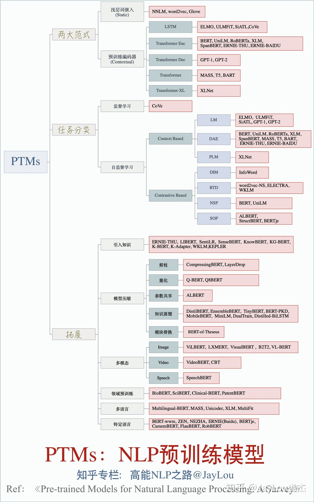

# 预训练模型

# 预训练模型

## 概述

预训练模型，则是使自然语言处理由原来的手工调参、依靠 ML 专家的阶段，进入到可以大规模、可复制的大工业施展的阶段。而且预训练模型从单语言、扩展到多语言、多模态任务。一路锐气正盛，所向披靡。

预训练通过自监督学习从大规模数据中获得与具体任务无关的预训练模型。体现某一个词在一个特定上下文中的语义表征。第二个步骤是微调，针对具体的任务修正网络。训练数据可以是文本、文本-图像对、文本-视频对。预训练模型的训练方法可使用自监督学习技术（如自回归的语言模型和自编码技术）。可训练单语言、多语言和多模态的模型。此类模型可经过微调之后，用于支持分类、[序列标记](https://www.zhihu.com/search?q=序列标记&search_source=Entity&hybrid_search_source=Entity&hybrid_search_extra={"sourceType"%3A"answer"%2C"sourceId"%3A1465037757})、结构预测和序列生成等各项技术，并构建文摘、机器翻译、图片检索、视频注释等应用。

为什么我们要做预训练模型？首先，预训练模型是一种迁移学习的应用，利用几乎无限的文本，学习输入句子的每一个成员的上下文相关的表示，它隐式地学习到了通用的语法语义知识。第二，它可以将从开放领域学到的知识迁移到下游任务，以改善低资源任务，对低资源语言处理也非常有利。第三，预训练模型在几乎所有 NLP 任务中都取得了目前最佳的成果。最后，这个预训练模型+微调机制具备很好的可扩展性，在支持一个新任务时，只需要利用该任务的标注数据进行微调即可，一般工程师就可以实现。

## 发展趋势

**首先，第一个关键技术是 Transformer**。它在 NLP 各个任务中都取得了优异的性能，它是预训练语言模型的核心网络。给定一句话或是一个段落作为输入，首先将输入序列中各个词转换为其对应的词向量，同时加上每一个词的位置向量，体现词在序列的位置。然后将这些词向量输入到多层 Transformer 网络中，通过自注意力（self-attention）机制来学习词与词之间的关系，编码其上下文信息，再通过一个前馈网络经过非线性变化，输出综合了上下文特征的各个词的向量表示。每一层 Transformer 网络主要由 Multi-head self-attention 层（[多头自注意力机制](https://www.zhihu.com/search?q=多头自注意力机制&search_source=Entity&hybrid_search_source=Entity&hybrid_search_extra={"sourceType"%3A"answer"%2C"sourceId"%3A1465037757})）和前馈网络层两个子层构成。[Multi-head self-attention](https://www.zhihu.com/search?q=Multi-head+self-attention&search_source=Entity&hybrid_search_source=Entity&hybrid_search_extra={"sourceType"%3A"answer"%2C"sourceId"%3A1465037757}) 会并行地执行多个不同参数的 [self-attention](https://www.zhihu.com/search?q=self-attention&search_source=Entity&hybrid_search_source=Entity&hybrid_search_extra={"sourceType"%3A"answer"%2C"sourceId"%3A1465037757})，并将各个 self-attention 的结果拼接作为后续网络的输入，self-attention 机制会在后面中做详细介绍。此后，我们得到了蕴含当前上下文信息的各个词的表示，然后网络会将其输入到前馈网络层以计算非线性层次的特征。

在每一层 Transformer 网络中，会将残差连接（residual connection）把自注意力机制前或者前馈神经网络之前的向量引入进来，以增强自注意力机制或者前馈网络的输出结果向量。并且还做一个 layer normalization，也就是通过归一化把同层的各个节点的[多维向量](https://www.zhihu.com/search?q=多维向量&search_source=Entity&hybrid_search_source=Entity&hybrid_search_extra={"sourceType"%3A"answer"%2C"sourceId"%3A1465037757})映射到一个区间里面，这样各层节点的向量在一个区间里面。这两个操作加入在每个子层后，可更加平滑地训练深层次网络。

Transformer 可以用于编码，也可以用于解码。所谓解码就是根据一个句子的输入得到一个预想的结果，比如机器翻译（输入源语言句子，输出目标语言句子），或者阅读理解（输入文档和问题，输出答案）。解码时，已经解码出来的词要做一个自注意力机制，之后和编码得到的隐状态的序列再做一个注意力机制。这样可以做 N 层，然后通过一个线性层映射到词表的大小的一个向量。每个向量代表一个词表词的输出可能性，经过一个softmax 层得到每个词的输出概率。

接下来介绍一下 self-attention 机制，以一个 head 作为示例。假定当前输入包含三个词，给定其输入词向量或是其上一层 Transformer 网络的输出，将其通过三组线性变换，转换得到三组 queries、keys 和 values 向量。Query 和 key 向量用来计算两两词之间的得分，也就是其依赖关系，这个得分会同其对应的 value 向量做加权和，以得到每个词综合上下文信息的表示。给定当前第一个词的 query 向量，其首先同各个词的 key 向量通过点积操作得到这两个词的得分，这些得分用来表示这两个词的依赖或是相关程度。这些得分之后会根据 query 等向量的维度做一定比例的缩放，并将这些得分通过 softmax 操作做归一化。之后，各个得分会同其相对应的 value 向量相乘得到针对第一个词加权的各个 value 向量，这些加权的 value 向量最终相加以得到当前第一个词的上下文表示。

在得到第一个词的上下文表示后，给定第二个词的 query 向量，我们会重复之前的操作，计算当前 query 向量同各个词 key 向量的得分，对这些得分做 softmax 归一化处理，并将这些得分同其对应的 value 向量做加权和，以得到其编码上下文信息的表示。

**第二个关键技术是自监督学习**。在预训练的模型中，AR（自回归）LM 和 AE（自动编码器）是最常用的自监督学习方法，其中，自回归 LM 旨在利用前面的词序列预测下个词的出现概率（语言模型）。自动编码器旨在对损坏的输入句子，比如遮掩了句子某个词、或者打乱了词序等，重建原始数据。通过这些自监督学习手段来学习单词的上下文相关表示。

**第三个关键技术就是微调**。在做具体任务时，微调旨在利用其标注样本对预训练网络的参数进行调整。以我们使用基于 BERT（一种流行的预训练模型）为例来判断两个句子是否语义相同。输入是两个句子，经过 BERT 得到每个句子的对应编码表示，我们可以简单地用预训练模型的第一个隐节点预测分类标记判断两个句子是同义句子的概率，同时需要额外加一个线性层和 softmax 计算得到分类标签的分布。预测损失可以反传给 BERT 再对网络进行微调。当然也可以针对具体任务设计一个新网络，把预训练的结果作为其输入。

总体来讲，预训练模型发展趋势：第一，模型越来越大。比如 Transformer 的层数变化，从12层的 Base 模型到24层的 Large 模型。导致模型的参数越来越大，比如 GPT 110 M，到 GPT-2 是1.5 Billion，图灵是 17 Billion，而 GPT-3 达到了惊人的 175 Billion。一般而言模型大了，其能力也会越来越强，但是训练代价确实非常大。第二，预训练方法也在不断增加，从自回归 LM，到自动编码的各种方法，以及各种多任务训练等。第三，还有从语言、多语言到多模态不断演进。最后就是模型压缩，使之能在实际应用中经济的使用，比如在手机端。这就涉及到知识蒸馏和 teacher-student models，把大模型作为 teacher，让一个小模型作为 student 来学习，接近大模型的能力，但是模型的参数减少很多。

每个观点都可以看一下参考文章。

## 深层表征阶段

在word embedding这篇文章里面，介绍了传统的词向量，也就是固定的词向量。本文将介绍deep contextualized词向量模型。也就是深层表征阶段。

两个伟大的想法：

- 编码的内容：从单词到上下文中的单词
（从 Word2Vec/GloVe/etc. 到 Cove/ELMo 的过渡）
- 用于下游任务：从仅替换特定任务模型中的词嵌入到替换整个特定任务模型
（从 Cove/ELMo 到 GPT/BERT 的过渡）。

具体的模型可以看本博客其余内容。

## 参考

> [https://www.zhihu.com/question/327642286](https://www.zhihu.com/question/327642286)
>
> [https://zhuanlan.zhihu.com/p/115014536](https://zhuanlan.zhihu.com/p/115014536)

